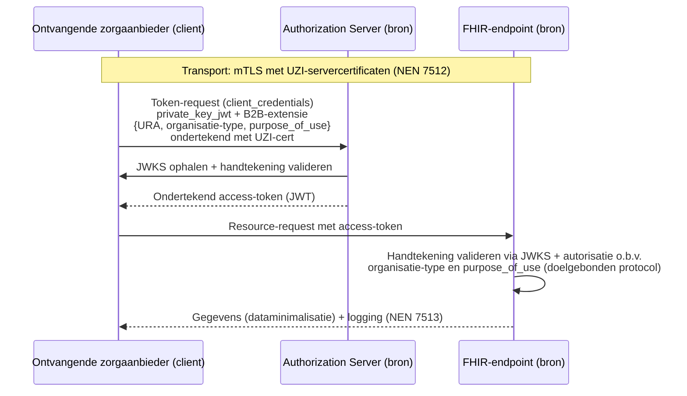

Harmonisatie van authenticatie en vertrouwensmodel bij BgZ- en eOverdracht-uitwisseling

### Status: **Concept** ter bespreking

Datum: 2 juli 2026

--> Niet meesturen van de rolinformatie --> wel organisatietype (SBI code KvK) en doelbinding. Treatment.
--> Aansluiting/registratie is niet aan de orde, buiten de al geldende registers. Zie vraag 2 en 3.
--> Twiin verwijderen

# Aanleiding en vraagstelling

De gegevensuitwisselingen BgZ (medisch-specialistische zorg) en eOverdracht (verpleegkundige overdracht) kennen beide een Wegiz-traject en worden in toenemende mate over dezelfde infrastructuren en volgens dezelfde uitwisselpatronen uitgevoerd. Er is geconstateerd dat de beproefde technische afspraak voor de BgZ afwijkt van die voor de eOverdracht. Harmonisatie van authenticatie en autorisatie is randvoorwaardelijk voor een efficiënte en veilige implementatie van beide uitwissselingen.

Deze notitie beantwoordt drie vragen:
1. Hoe wordt op korte termijn de authenticatie van zorgverleners en zorgsystemen geharmoniseerd (interne authenticatie en autorisatie)?
2. Hoe wordt op korte termijn de authenticatie van zorgaanbieders geharmoniseerd (externe authenticatie en autorisatie)?
3. Hoe worden de risico's in het vertrouwensmodel juridisch, organisatorisch en technisch afgedekt?

De beantwoording volgt per vraag, waarbij rekening wordt gehouden met de verschillende architectuurlagen. Hierbij wordt eerst beschreven wat de wettelijke kaders zijn voor interne en externe authenticatie. Het verschil tussen deze twee is van belang voor de verdere uitwerking en de eisen die in het document zijn opgenomen.

Het laatste hoofdstuk bevat een samenvattende lijst van vereisten waaraan zorgaanbieders moeten voldoen om de BgZ- en eOverdracht-uitwisselingen veilig en efficiënt te kunnen uitvoeren.

# Wettelijk kader

## Interne authenticatie

De AVG en de Wabvpz verplichten iedere zorgaanbieder als zelfstandig verwerkingsverantwoordelijke tot passende beveiliging en een voldoende betrouwbaarheidsniveau van authenticatie voor de eigen systemen en medewerkers. De wet schrijft niet voor dat een uitwisselingspartner die authenticatie nogmaals of zelfstandig uitvoert. NEN 7510 en NEN 7512 bieden het normenkader waarmee de betrouwbaarheid van de interne processen aantoonbaar wordt gemaakt richting de partner. Zorgaanbieders zijn verplicht om aan de eisen uit NEN 7510 en NEN 7512 te voldoen.

Het streefbeeld blijft landelijk uniform inloggen via Dezi na inwerkingtreding van de Wet DIAZ, maar ook in dat stelsel blijft de lijn dat de zorgaanbieder de werkrelatie met de zorgmedewerker registreert en de toegang organiseert. Na implementatie van Dezi verandert er dus niets aan de A&A in uitwisseling tussen zorgaanbieders.

## Externe authenticatie

De identiteit van de zorgaanbieder als organisatie is wettelijk verankerd via het UZI-register (Wabvpz). Het daaraan gekoppelde abonneenummer (URA) fungeert als de stelselbrede, onweerlegbare organisatie-identifier. Beide uitwisselingen dienen op korte termijn op ditzelfde identificatiestelsel te steunen. Er is geen juridische ruimte of noodzaak voor een afwijkend regime per zorgtoepassing. 

Daarbij past de volgende begripsafbakening: de eIDAS-betrouwbaarheidsniveaus (laag, substantieel, hoog) zijn gedefinieerd voor elektronische identificatiemiddelen van personen en zijn niet van toepassing op certificaten waarmee systemen zich authenticeren. Deze certificaten vallen onder de afspraken van vertrouwensstelsels. De betrouwbaarheid van de organisatieauthenticatie wordt dus niet uitgedrukt in een eIDAS-niveau, maar ontleend aan het gecontroleerde uitgifteproces van het UZI-register en de PKIoverheid-eisen, in combinatie met NEN 7512 voor de eisen aan de verbinding.

# Vraag 1: Authenticatie van zorgverleners en -systemen (korte termijn)

Voor beide uitwisselingen geldt hetzelfde federatieve principe: Zorgaanbieders zijn alleen verantwoordelijk voor de identificatie en authenticatie van zorgverleners en zorgsystemen binnen diens eigen beveiligingsdomein (Interne authenticatie). Bij de uitwisseling van zorggegevens voert een zorgaanbieder geen eigen identificatie, authenticatie of verificatie op het niveau van de individuele zorgverlener of het individuele systeem uit die binnen de verantwoordelijkheid van de uitwisselingspartner vallen. Een zorgaanbieder moet uitgaan van de betrouwbare processen van de uitwisselingspartner. Het vertrouwen verschuift daarmee van middelniveau (het controleren van een authenticatiemiddel van de ander) naar procesniveau (het vertrouwen op een aantoonbaar goed ingericht IAM-proces bij de ander). Alleen de organisatie-identiteit wordt over de organisatiegrens heen geverifieerd (zie vraag 2).

Een zorgaanbieder richt één intern authenticatie- en autorisatieproces in dat voor alle uitwisselingen, BgZ en eOverdracht, wordt gebruikt. Op korte termijn logt de zorgverlener eenmalig in binnen het lokale IAM-domein (conform NEN 7510). De zorgaanbieder staat er als organisatie voor in dat degene die de uitwisseling initieert een geauthenticeerde, geautoriseerde medewerker met een geldige behandelrelatie is. Hetzelfde geldt voor zorgsystemen. Het beheer, de registratie en de authenticatie van systemen die namens de zorgaanbieder communiceren (EPD, ECD, koppelvlak, knooppunt) vallen onder het interne beheerproces van die zorgaanbieder. 

De uitwisselingspartner hoeft dus niet te weten of te controleren welk systeem of welke medewerker aan de andere kant actief is. Hij vertrouwt erop dat de partner de processen betrouwbaar heeft ingericht. Dit wederzijds vertrouwen is niet vrijblijvend, maar wordt georganiseerd via geharmoniseerde afspraken. Door toetreding / registratie als zorgaanbieder verklaart en toont iedere zorgaanbieder aan dat de interne processen aan de gestelde normen voldoen (zie vraag 3).

## Applicatief niveau

Omdat de partner geen verificatie op persoons- of systeemniveau uitvoert, volstaat het dat de transactie de context meedraagt die nodig is voor autorisatie, logging en herleidbaarheid. Hiervoor worden de organisatie-identiteit (URA), het doel (behandeling, vitaal belang, etc) en het organisatietype (t.b.v toestemming-check) meegegeven. Deze attributen worden meegegeven als verklaring van de zorgaanbieder, niet als te verifiëren bewijs. De beschikbaarstellende partij gebruikt de informatie uitsluitend voor het autorisatiebesluit conform het doelgebonden autorisatieprotocol en legt de attributen vast in de logging. Zij valideert niet zelf de onderliggende authenticatie. Door voor BgZ en eOverdracht dezelfde attributenset en hetzelfde verklaringsformaat te hanteren, is het autorisatie- en loggingsproces bij de bron voor beide uitwisselingen identiek.

## Transport niveau

De ontvangende partij controleert uitsluitend dat de verklaring afkomstig is van de geauthenticeerde organisatie, niet de juistheid van de inhoud. Hoe een zorgaanbieder de interne authenticatie technisch invult (bijvoorbeeld een wachtwoord met MFA, smartcard, UZI-pas waar beschikbaar, single sign-on vanuit het EPD/ECD) is een lokale keuze binnen de normkaders en is voor de uitwisselingspartner niet zichtbaar en niet relevant. Dit maakt de gegevensuitwisseling tussen zorgaanbieders direct toepasbaar in zowel de BgZ als eOverdracht, en is migratievast richting Dezi.

# Vraag 2: Authenticatie van zorgaanbieders (korte termijn)

De identiteit van de zorgaanbieder als organisatie is wettelijk verankerd via het UZI-register (Wabvpz). Het daaraan gekoppelde abonneenummer (URA) fungeert als de stelselbrede, onweerlegbare organisatie-identifier. Voor authenticatie wordt een servercertificaat gebruikt dat aangemaakt is o.b.v. een public & private key. 

## Applicatief niveau

De organisatie-identiteit (URA) wordt in beide uitwisselingen op dezelfde plaats in de transactie meegegeven en gevalideerd, conform geharmoniseerde afspraken. Waar een knooppunt of intermediair kan optreden als technisch vertegenwoordiger van de zorgaanbieder, blijft de zorgaanbieder zelf de geïdentificeerde en verantwoordelijke partij. In de gegevensuitwisseling moet de oorspronkelijke organisatie-identiteit daarom meegestuurd worden naar de uitwisselingspartner en niet vervangen door die van een mogelijke intermediair.

De organisatie-identiteit wordt op berichtniveau geborgd via ondertekende tokens (signatuire in token-request en access-token) waarvan de handtekening wordt gevalideerd met behulp van JWKS (JSON Web Key Set). Iedere zorgaanbieder publiceert de publieke sleutels op een JWKS-endpoint, conform geharmoniseerde afspraken. De ontvangende partij haalt de sleutelset op via dit endpoint en valideert daarmee dat het token daadwerkelijk door de geclaimde organisatie is afgegeven en onderweg niet is gewijzigd.

## Transport niveau

De transportlaag wordt op korte termijn beveiligd met wederzijdse TLS (mTLS) op basis van UZI-servercertificaten. Certiticaten die gebruikt worden op de transportlaag moeten zijn uitgegeven door het CIBG. Dit borgt de authenticatie van de organisatie op verbindingsniveau (NEN 7512) en is het enige op korte termijn beschikbare middel voor systeem-tot-systeemauthenticatie op voldoende betrouwbaarheidsniveau. Op langere termijn kan dit vervangen worden daar LDN-Veilig Netwerk certificaten. Dit is ook reden om op dit moment niet te kiezen voor zorgaanbieder-authenticatie d.m.v. het client-certificaat (mTLS). 

# Vraag 3: Afdekking van risico's in het vertrouwensmodel

## De centrale ontwerpbeslissing en het bijbehorende risico

Het vertrouwensmodel van deze geharmoniseerde uitwisselingen rust op één expliciete ontwerpbeslissing: een zorgaanbieder verifieert bij uitwisseling niets op het niveau van de individuele zorgverlener of het individuele zorgsysteem van de partner, maar vertrouwt op de betrouwbare inrichting van diens interne processen. De enige verificatie die de organisatiegrens uitvoert, is die van de organisatie-identiteit zelf. De dossierhouder, op wie de geheimhoudingsplicht rust en die daarom zekerheid moet hebben over wie hij toestaat gegevens te verwerken, ontleent die zekerheid dus aan de authenticatie en autorisatie van de uitwisselingspartner.

Het kernrisico volgt direct uit deze beslissing: een tekortschietend intern proces bij één zorgaanbieder werkt door in de vertrouwelijkheid van dossiers bij alle uitwisselpartners, zonder dat die partners dit in de transactie kunnen detecteren. De borging moet daarom volledig worden georganiseerd op drie momenten buiten de transactie:

1. vooraf (toetreding),
2. doorlopend (toezicht en beheer) en 
3. achteraf (herleidbaarheid en aansprakelijkheid).

De zeven onderdelen van het vertrouwensmodel (identificatie, authenticatie, autorisatie, behandelrelatie, patiënttoestemming, logging en transparantie) worden langs deze drie momenten en langs drie sporen afgedekt.

## Juridisch

Iedere zorgaanbieder is en blijft zelfstandig verwerkingsverantwoordelijke (AVG) voor de verwerking van persoonsgegevens in de eigen systemen, met inbegrip van het knooppunt of de intermediair die namens hem optreedt. De zorgaanbieder is het aanspreekpunt voor betrokkenen bij de uitoefening van hun privacyrechten. Het federatieve model verschuift die verantwoordelijkheid niet, maar maakt haar scherp belegbaar: omdat de partner uitsluitend afgaat op verklaringen van de zorgaanbieder, is die zorgaanbieder juridisch volledig aansprakelijk voor de juistheid daarvan. 

De wettelijke verplichtingen uit de Wabvpz rond logging en het inzagerecht van de cliënt gelden onverkort aan beide zijden en vormen de juridische basis voor de totale herleidbaarheid achteraf. 

Tot slot borgt het juridisch spoor de zuiverheid van de gehanteerde betrouwbaarheidskaders: de organisatieauthenticatie ontleent haar betrouwbaarheid aan het wettelijk geregelde uitgifteproces van het UZI-register, terwijl voor de lokale authenticatie van zorgverleners een afgesproken eIDAS-betrouwbaarheidsniveau als norm geldt.

## Organisatorisch

Belangrijke voorwaarden voor zorgaanbieders t.a.v. gegevensuitwisseling (niet uitputtend):

* een betrouwbaar vastgestelde organisatie-identiteit (URA) gekoppeld aan het technische aansluitpunt,
* kwalificatie van het knooppunt of koppelvlak, 
* aantoonbare conformiteit aan NEN 7510 en een ingericht IAM-proces dat zowel medewerker- als systeemidentiteiten omvat en
* het confidentieel kunnen houden van private keys waarmee de zorgaanbieder of haar dienstverlener haar verklaringen ondertekent en publicatie van bijbehorende public keys (JWKS-endpoint).

Het vertrouwen tussen partners is daarmee georganiseerd. Iedere zorgaanbieder heeft vooraf aangetoond dat de processen waarop anderen vertrouwen daadwerkelijk op orde zijn. De doorlopende borging bestaat uit periodieke audits en hercertificering, beheerprocessen voor sleutelrotatie en intrekking bij compromittering, en een sanctie- en uitsluitingsregime van de stelselbeheerder waarmee een zorgaanbieder wiens processen niet langer voldoen snel uit het vertrouwensdomein kan worden verwijderd.

Het onderdeel transparantie borgt dat iedere zorgaanbieder voor aansluiting weet op welke afspraken de anderen vertrouwen en waaraan hij zelf gehouden is. Binnen elke organisatie is regulier autorisatiebeheer de voorwaarde voor de betrouwbaarheid van de verklaringen die namens de organisatie worden afgegeven.

## Technisch
De technische maatregelen verifiëren niet de inhoud van verklaringen, maar borgen herkomst, integriteit en herleidbaarheid. Op verbindingsniveau garandeert mTLS met UZI-servercertificaten (NEN 7512) dat communicatie uitsluitend plaatsvindt tussen toegetreden, geauthenticeerde organisaties. In combinatie met het gebruik van JKWS is daarmee op meerdere niveaus bewezen welke organisatie de uitwisselingspartner is.

Logging conform NEN 7513 legt vast welke zorgverlener, in welke rol, namens welke organisatie toegang heeft gehad. 

Hierdoor is elke raadpleging herleidbaar en het inzagerecht van de patiënt kan worden waargemaakt. De autorisatiecontrole bij de bron, op basis van de meegeleverde rolinformatie conform het autorisatieprotocol van de zorgtoepassing, vormt de laatste technische begrenzing. Ook bij een volledig vertrouwde partner worden nooit meer gegevens verstrekt dan de rol en de zorgtoepassing rechtvaardigen. Dataminimalisatie fungeert daarmee als vangnet dat de impact van een eventueel falend proces bij de partner begrenst.

# Requirements

In deze specificatie worden sommige woorden bewust in HOOFDLETTERS geschreven, zoals MOET, MAG NIET, BEHOORT en MAG. Dit markeert normatieve kracht en helpt om eisen, aanbevelingen en opties eenduidig te onderscheiden:

* MOET / MOETEN (SHALL): harde eis.
* MAG NIET (SHALL NOT): expliciet verbod.
* BEHOORT (SHOULD): sterke aanbeveling waarvan alleen met goede redenen afgeweken kan worden.
* MAG (MAY): toegestane optie.

## Identificatie en authenticatie van de zorgaanbieder

1. De zorgaanbieder MOET geregistreerd zijn in het UZI-register en MOET het URA-nummer als enige organisatie-identifier hanteren in beide uitwisselingen.
2. De zorgaanbieder MOET beschikken over een geldig UZI-servercertificaat waarin het URA is opgenomen, ten behoeve van systeem-tot-systeemauthenticatie.
3. Alle uitwisselverbindingen MOETEN worden opgezet met wederzijdse TLS (mTLS) op basis van dit UZI-servercertificaat, conform NEN 7512.
4. De zorgaanbieder (of het knooppunt dat namens hem optreedt) MOET alle uitgaande verklaringen (tokens) cryptografisch ondertekenen en MOET de bijbehorende publieke sleutels publiceren op een JWKS-endpoint.
5. Het JWKS-endpoint MOET gepubliceerd zijn conform specificatie in Generieke Functie Adressering (bijvoorbeeld op een ./well-known pad bij een FHIR-endpoint).
6. De ontvangende partij MOET van ieder inkomend token de handtekening valideren via het JWKS-endpoint van de afgevende organisatie, alvorens de transactie te verwerken.
7. De zorgaanbieder MAG een knooppunt of intermediair inzetten als technisch vertegenwoordiger. De oorspronkelijke organisatie-identiteit (URA) MOET daarbij end-to-end worden meegevoerd en MAG NIET worden vervangen door de identiteit van de intermediair.

## Authenticatie van zorgverleners en zorgsystemen

10. De zorgaanbieder MOET de authenticatie van eigen zorgverleners en eigen zorgsystemen zelfstandig uitvoeren binnen het eigen beveiligingsdomein.
11. Een uitwisselende partij MAG NIET zelf authenticatie of verificatie uitvoeren op het niveau van individuele zorgverleners of individuele systemen van de uitwisselpartner. De uitwisselende partij MOET uitgaan van de betrouwbare processen van de partner zoals geborgd via het stelsel.
12. Iedere transactie MOET als door de zorgaanbieder afgegeven verklaring de volgende attributen meedragen: de organisatie-identiteit (URA), het achterliggende doel van de transactie (b.v. 'behandeling') en het organisatie-type.

## Autorisatie
30. De beschikbaarstellende partij MOET bij iedere opvraging een autorisatiecontrole uitvoeren op basis van de meegeleverde organisatie-type en doel, conform het doelgebonden autorisatieprotocol.
32. De ontvangende partij MOET uitsluitend de herkomst en integriteit van de verklaring valideren.

## Logging, herleidbaarheid en rechten van de patiënt

40. Beide partijen MOETEN iedere uitwisseling loggen conform NEN 7513, zodanig dat vastligt welke interne zorgverlener of externe zorgaanbieder in welke rol toegang heeft gehad.
41. De logging en de meegeleverde attributen MOETEN de zorgaanbieder in staat stellen het inzagerecht van de patiënt (Wabvpz) waar te maken, ook voor raadplegingen waarvan de authenticatie buiten het eigen domein plaatsvond.
42. De borging van behandelrelatie en patiënttoestemming MOET zijn belegd conform de per zorgtoepassing in het afsprakenstelsel vastgelegde verdeling.

## Juridische verantwoordelijkheid en aansprakelijkheid

50. Iedere zorgaanbieder MOET als zelfstandig verwerkingsverantwoordelijke (AVG) optreden voor de verwerking in de eigen systemen, met inbegrip van een eventueel knooppunt dat namens hem optreedt, en MOET het aanspreekpunt zijn voor betrokkenen bij privacyrechtverzoeken. Deze verantwoordelijkheid MAG NIET contractueel worden overgedragen aan een intermediair of uitwisselpartner.
51. De zorgaanbieder MOET volledige aansprakelijkheid aanvaarden voor de juistheid van alle namens hem afgegeven verklaringen.

# Bijlage A: Technische implementatie op basis van bestaande internationale standaarden

Deze bijlage is een niet-normatieve suggestie voor de technische invulling van de richtlijnen uit deze notitie. Uitgangspunt is dat **uitsluitend bestaande, internationaal beproefde standaarden** worden hergebruikt en dat er geen nieuwe stelselspecifieke techniek wordt ontworpen. De invulling moet de drie attributen uit vraag 1 kunnen dragen — de **organisatie-identifier (URA)**, het **organisatie-type** en het **doel (purpose_of_use)** — waarbij alleen de organisatie-identifier verifieerbaar hoeft te zijn en de overige twee attributen als verklaring van de zorgaanbieder worden meegegeven.

## A.1 Afweging: Verifiable Credentials en de EU Business Wallet

Een voor de hand liggende, "moderne" route zou zijn om de attributen als **Verifiable Credentials (VC's)** uit te geven en te presenteren vanuit een **EU(DI) (Business) Wallet** onder eIDAS 2.0. Voor de hier beschreven uitwisselingen levert die route op korte termijn echter geen noemenswaardig voordeel op, om de volgende redenen:

* **De specificaties zijn nog niet gereed.** Het Architecture Reference Framework voor de EUDI-wallet en de uitwerking van de organisatie- of *Business*-wallet zijn nog in ontwikkeling en aan verandering onderhevig. Bouwen op een bewegend doel introduceert herwerk- en interoperabiliteitsrisico.
* **De benodigde componenten ontbreken.** Productierijpe wallet-, issuer- en verifier-software is nog niet breed beschikbaar, en er is nog geen operationele **credential-issuer** voor deze attributen. Het **CIBG** geeft (URA-)identiteiten vandaag uit als UZI-certificaten, niet als Verifiable Credentials; een VC-uitgifteproces zou eerst moeten worden opgetuigd.
* **De verifieerbaarheidsbehoefte is minimaal.** Van de drie attributen hoeft alleen de organisatie-identifier verifieerbaar te zijn, en die verifieerbaarheid wordt al geleverd door het UZI-certificaat en de ondertekening van de tokens (zie A.4). Organisatie-type en doel zijn per definitie zelf-verklaringen van de zorgaanbieder (zie vraag 1) en profiteren dus niet van de *selective disclosure*- en bewijskracht-eigenschappen van VC's.
* **Onevenredige complexiteit.** De aanvullende machinerie van VC's (issuer-registers, statuslijsten, presentatieprotocollen, wallets) staat niet in verhouding tot één te verifiëren attribuut dat al op een eenvoudiger manier geborgd is.

**Conclusie:** Verifiable Credentials en een EU Business Wallet worden op korte termijn niet gekozen. Zodra de standaarden en componenten (inclusief een issuer zoals het CIBG) volwassen zijn, kan deze afweging opnieuw worden gemaakt; de hieronder gekozen OAuth2-basis is daar migratievast naartoe.

## A.2 Keuze voor "standaard" OAuth2

In plaats van VC's wordt gekozen voor beproefde **OAuth 2.0**-profielen. Binnen OAuth2 bestaan meerdere profielen die relevant zijn voor server-tot-server-uitwisseling in de zorg:

| Profiel | Kern | Attributen | Positionering |
| --- | --- | --- | --- |
| [SMART Backend Services](https://hl7.org/fhir/smart-app-launch/backend-services.html) | `client_credentials` met **`private_key_jwt`** en JWKS-publicatie | Scopes; geen inhoudelijke context-attributen | Voorgesteld binnen het **EHDS/Xt-EHR/Euridice**-initiatief van HL7-EU en IHE-EU |
| [IHE IUA](https://profiles.ihe.net/ITI/IUA/index.html) | OAuth2-authenticatie/-autorisatie met de **JWT IUA-extensie** | Definieert o.a. **`purpose_of_use`** en **`national_provider_identifier`** | IHE-standaard voor A&A |
| [UDAP B2B](https://build.fhir.org/ig/HL7/fhir-udap-security-ig/b2b.html) | `client_credentials` met dynamische clientregistratie (DCR) | **B2B Authorization Extension Object** met codelijsten voor **`purpose_of_use`** en **`organization_id`** | Ook aangehaald vanuit **EHDS/Euridice** (t.b.v. DCR) |
| [FAPI 2.0 Security Profile](https://openid.net/specs/fapi-security-profile-2_0.html) | Beveiligings*hardening* bovenop OAuth2 | Geen eigen attributen; scherpt security aan | O.a. in de **Noorse zorg** in gebruik ([toelichting](https://openid.net/scaling-fapi-2-0-to-transform-healthcare-security-in-norway/)) |

De eerste drie profielen definiëren een **flow** (hoe een token wordt aangevraagd en welke attributen worden meegedragen). FAPI 2.0 is geen flow, maar een **beveiligingsprofiel** dat bovenop zo'n flow wordt gelegd en de hoogste, aantoonbaar beproefde beveiligingsgaranties biedt (sender-constrained tokens, verplichte PAR, strikte validatieregels, weerbaarheid tegen bekende aanvalsklassen).

## A.3 Client-authenticatie: `private_key_jwt` in plaats van mTLS-clientcertificaat

Diverse van bovenstaande profielen laten voor client-authenticatie de keuze tussen **mTLS (client-certificaat)** en **`private_key_jwt`** (een door de client ondertekende JWT-assertie). Voor deze uitwisselingen wordt gekozen voor `private_key_jwt`, omdat:

* enkele dienstverleners expliciet **geen voorkeur hebben voor mTLS-clientauthenticatie** en de `private_key_jwt`-methode verkiezen;
* dit aansluit bij de reeds in deze notitie gekozen lijn van **op berichtniveau ondertekende tokens met JWKS-publicatie** (vraag 2), waardoor de organisatie-identiteit end-to-end door intermediairs heen geborgd blijft en niet aan de TLS-terminatie gebonden is;
* de **Nuts-node** momenteel `did:web` gebruikt: publieke sleutels worden al via een web-endpoint gepubliceerd en opgehaald. De stap naar `private_key_jwt` met **JWKS-endpoints** is daardoor klein en conceptueel vergelijkbaar.

De transportlaag blijft daarnaast, conform vraag 2, beveiligd met **mTLS op basis van UZI-servercertificaten** (NEN 7512). mTLS wordt dus wél gebruikt voor de transportbeveiliging, maar níét als middel voor OAuth-clientauthenticatie.

## A.4 Aanbeveling: FAPI 2.0 als beveiligingsbasis, SMART Backend Services als flow, met attribuutuitbreiding

De meest veilige oplossing die tegelijk `private_key_jwt` ondersteunt en de drie gevraagde attributen kan meedragen, is een combinatie:

1. **FAPI 2.0 Security Profile** als verplichte **beveiligingsbasislijn**. Dit is het profiel met de zwaarste, internationaal beproefde beveiligingsgaranties (o.a. toegepast in de Noorse zorg) en het schrijft `private_key_jwt` als clientauthenticatie voor.
2. **SMART Backend Services** als **flow** (`client_credentials` + `private_key_jwt` + JWKS-publicatie). Dit profiel wordt binnen EHDS/Euridice voorgesteld, is FHIR-native en volledig FAPI 2.0-compatibel.
3. **Attribuutuitbreiding** voor de context. De drie attributen worden meegegeven volgens een bestaande, gestandaardiseerde structuur in plaats van een eigen ontwerp:
   * de **UDAP B2B Authorization Extension Object** (`hl7-b2b`), die `organization_id` en `purpose_of_use` met codelijst definieert, óf
   * de **IHE JWT IUA-extensie**, die `purpose_of_use` en `national_provider_identifier` definieert.

   Beide worden ook vanuit EHDS/Euridice aangehaald. Het organisatie-type wordt als aanvullende claim (bijvoorbeeld op basis van de SBI-code uit het KvK-register) in dezelfde extensie meegegeven. Aanbevolen wordt de **UDAP B2B-extensie** te volgen, omdat die `purpose_of_use` met codelijst dekt en het dichtst bij de gevraagde attributenset ligt.

### Ondertekening met het UZI-certificaat

Zowel het **token-request** als het **access-token** worden ondertekend met (de sleutel behorend bij) het **UZI-certificaat van de zorgaanbieder**:

* het **token-request** is een `private_key_jwt`-clientassertie plus de B2B Authorization Extension, ondertekend door de aanvragende zorgaanbieder;
* het **access-token** is een ondertekend JWT waarvan de handtekening door de ontvangende partij wordt gevalideerd via het **JWKS-endpoint** van de afgevende organisatie (conform requirement 4 t/m 6).

Alleen de **organisatie-identifier (URA)** is daarmee cryptografisch verifieerbaar; **organisatie-type** en **doel** worden als door de zorgaanbieder afgegeven verklaring meegevoerd, exact zoals vraag 1 voorschrijft.

### Schematisch verloop

## A.5 Aansluiting op de requirements

Deze invulling realiseert de eisen uit het hoofdstuk Requirements met bestaande standaarden:

* **Req. 1–3:** URA uit UZI-register; mTLS met UZI-servercertificaten op transport.
* **Req. 4–6:** `private_key_jwt` en ondertekende JWT-tokens, gevalideerd via JWKS (SMART Backend Services / UDAP).
* **Req. 5:** JWKS-publicatie via een `.well-known`-pad bij het FHIR-endpoint, conform SMART Backend Services en Generieke Functie Adressering.
* **Req. 7:** end-to-end meevoeren van de URA past bij tokengebaseerde (i.p.v. TLS-gebonden) organisatie-identiteit.
* **Req. 12:** de drie attributen (URA, purpose_of_use, organisatie-type) via de UDAP B2B- of IUA JWT-extensie.
* **Req. 30 & 32:** autorisatiebesluit bij de bron op basis van organisatie-type en doel; ontvanger valideert uitsluitend herkomst en integriteit (JWKS).