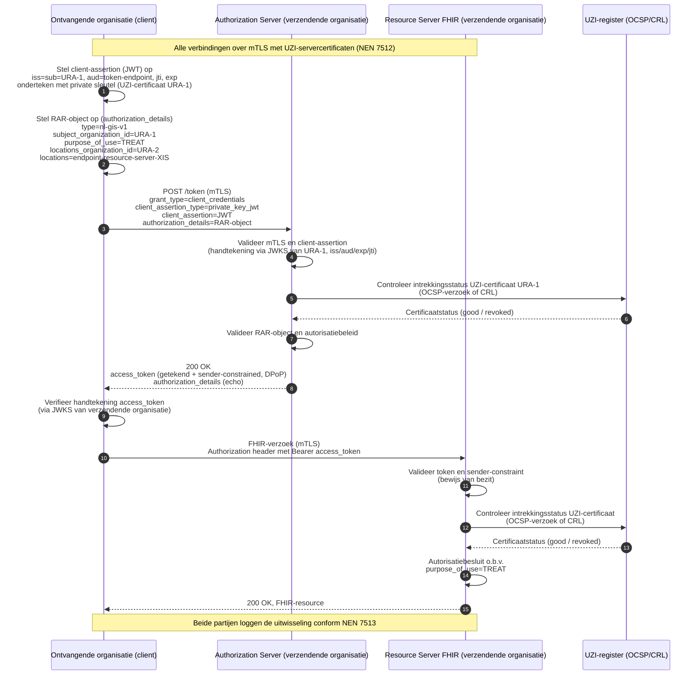

# Harmonisatie van authenticatie en autorisatie

**voor de gegevensuitwisselingen BgZ en eOverdracht**

*Status: concept ter bespreking — Datum: 10 juli 2026*

## 1. Inleiding

In de Nederlandse zorg worden steeds meer medische gegevens digitaal uitgewisseld tussen zorgaanbieders. Twee belangrijke uitwisselingen zijn de Basisgegevensset Zorg (BgZ), waarmee medisch specialisten patiëntgegevens delen, en eOverdracht, de verpleegkundige overdracht. Beide zijn wettelijk verplicht onder de Wegiz en verlopen in toenemende mate over dezelfde technische infrastructuur.

Bij het beproeven van deze uitwisselingen bleek dat de technische afspraken voor de BgZ afwijken van die voor eOverdracht. Dat is onwenselijk: zorgaanbieders moeten dan twee vergelijkbare voorzieningen inrichten en per uitwisseling bepalen welke methode geldt. Dit is duurder en foutgevoeliger. Harmonisatie van **authenticatie** (betrouwbaar vaststellen wie iemand of welke organisatie iets is) en **autorisatie** (bepalen wat een partij mag) is daarom een randvoorwaarde voor een interoperabele, efficiënte en veilige uitwisseling.

31 maart 2026 heeft het Ministerie van VWS een memo (escalatie) van Twiin ontvangen met de titel 'Overbrugging authenticatie eis voor landelijke databeschikbaarheid'. Deze notitie beantwoordt de drie vragen uit de memo, met nadruk op de korte termijn:

1) Hoe wordt authenticatie op zorgaanbieder-niveau vormgegeven, ook op lange termijn onder het
DEZI-stelsel?
2) Hoe kan authenticatie (zowel van zorgverlener als van zorgaanbieder) worden ingevuld in de (korte-
termijn) uitwerking van TA’s voor communicatiepatronen? Welke identificatie- en
authenticatiemethoden worden geaccepteerd voor de zorgverlener dan wel zorgaanbieder bij de
verschillende communicatiepatronen?
3) Welke risico’s worden met techniek afgedekt en welke worden met afspraken en overeengekomen
processen geborgd?

## 2. Scope

**In scope:** het verzenden van zorggegevens tussen twee zorgaanbieders binnen de BgZ en eOverdracht. Bij deze uitwisselingen gaat een verwijzing of overdracht vooraf. Er is daardoor bij de ontvangende organisatie sprake van een (startende) behandelrelatie en van **veronderstelde toestemming**: de toestemming van de patiënt ligt al besloten in de instemming met de verwijzing. Een aparte toestemmingscontrole bij de verwijzende/verzendende zorgaanbieder is dan niet nodig.

**Buiten scope:** autorisatie voor andere use cases, zoals een databevraging *zonder* voorafgaande verwijzing (geen veronderstelde toestemming) of uitwisseling die niet tussen twee zorgaanbieders verloopt (bijvoorbeeld vanuit een PGO of onderzoeksinstelling). De bevraging-use case wordt op hoofdlijnen geschetst in paragraaf 6, omdat de gekozen techniek daar goed op voorbereid is.

## 3. Juridisch kader

Vanuit de wet (WGBO, AVG en Wabvpz) volgt het volgende kader voor de uitwisselingen die in scope van deze notitie vallen:

- **De bronhoudende zorgaanbieder is niet verantwoordelijk voor de authenticatie en autorisatie van zorgverleners of systemen bij een andere zorgaanbieder.** De AVG en de Wabvpz beleggen de plicht tot passende beveiliging en betrouwbare authenticatie van medewerkers en systemen bij iedere zorgaanbieder zelf, als zelfstandig verwerkingsverantwoordelijke. Een zorgaanbieder hoeft de authenticatie van de uitwisselingspartner dus niet over te doen en mag afgaan op diens verklaring.
- **De bronhoudende zorgaanbieder is wél verantwoordelijk voor de authenticatie en autorisatie van de andere zorgaanbieder waarmee data uitgewisseld wordt.** Over de organisatiegrens heen wordt uitsluitend de identiteit van de uitwisselingspartner (de andere zorgaanbieder) geverifieerd. Voor de autorisatie van de uitwisseling moet ook het doel of grondslag voor uitwisseling bekend zijn (voor eOverdracht en BgZ; 'uitvoering van de behandelingsovereenkomst'). 
- **Voor eOverdracht en BgZ-verwijzing is een (startende) behandelrelatie vereist, maar deze hoeft niet schriftelijk te zijn vastgelegd.** Voor eOverdracht en BgZ-verwijzing wordt gebruik gemaakt van de wettelijke grondslag uit de WGBO; 'noodzakelijk voor de uitvoering van de behandelingsovereenkomst'. Vanuit het juridische kader is het niet noodzakelijk om deze behandelovereenkomst of behandelrelatie schriftelijk vast te leggen. Het verifieren van de patienttoestemming door de verwijzende zorgaanbieder is niet nodig, aangezien de toestemming van de patiënt al besloten ligt in de instemming met de verwijzing.

Dit juridisch kader leidt tot een **federatieve vertrouwensmodel**: iedere zorgaanbieder is exclusief verantwoordelijk voor de authenticatie en autorisatie van de eigen zorgverleners en systemen binnen het eigen beveiligingsdomein. Bij uitwisseling tussen zorgaanbieders vertrouwt de (bronhoudende) zorgaanbieder de 'interne' authenticatie en autorisatie van de andere zorgaanbieder. Dat vertrouwen is niet vrijblijvend: het wordt afgedwongen via wettelijk verplichte normen (NEN 7510/7512/7513), toetredingseisen vooraf, audits en toezicht doorlopend, en logging en aansprakelijkheid achteraf. Met deze eisen voor logging (NEN 7513) en het inzagerecht van de patiënt — geregeld in de Wabvpz — moet achteraf te achterhalen zijn wie (welke zorgverlener) of welk systeem bij een andere zorgaanbieder data heeft opgevraagd.

De organisatie-identiteit is wettelijk verankerd in het UZI-register (Wabvpz). Het URA-nummer (UZI-RegisterAbonneenummer) is de stelselbrede, unieke organisatie-identificatie en moet binnen beide uitwisselingen, eOverdracht en BgZ, worden gebruikt.

Na de inwerkingtreding van de Wet DIAZ moet voor de landelijk uniforme authenticatie van zorgverleners gebruik worden gemaakt van het Dezi-stelsel. Dit wijzigt de zorgaanbieder-*interne* authenticatie: Dezi vervangt het lokale inlogmiddel van de zorgverlener. Het raakt echter niet de verdeling van verantwoordelijkheid: de zorgaanbieder blijft zelf verantwoordelijk voor de werkrelatie met de zorgmedewerker en de toegang tot patiëntgegevens. De komst van Dezi heeft daarom **geen effect op de zorgaanbieder-authenticatie of op de uitwisseling tussen zorgaanbieders** — de uitwisselingspartner voert immers geen eigen authenticatie van zorgverleners uit (zie het federatieve model hierboven). De in deze notitie gekozen aanpak is hierop voorbereid, ook voor de lange termijn.

## 4. Eisen aan de technische implementatie

Uit het juridisch kader volgen de eisen die de techniek moet invullen:

1. **Wederzijds vaststellen van de identiteit van de zorgaanbieder.** Beide partijen stellen betrouwbaar vast met welke organisatie zij uitwisselen, op basis van het URA uit het UZI-register.
2. **Geen authenticatie van individuele zorgverleners of systemen van de partner.** De techniek hoeft (en mag) niet op persoons- of systeemniveau controleren; zij draagt alleen de context mee die nodig is voor autorisatie, logging en herleidbaarheid op organisatieniveau.
3. **Expliciet meedragen van het doel van de uitwisseling.** De doelstelling moet expliciet worden benoemd, zodat deze te onderscheiden is van andere (later te ondersteunen) doelstellingen, en de bron er een autorisatiebesluit op kan baseren.
4. **Herkomst en integriteit borgen, end-to-end.** De verzendende organisatie moet kunnen vaststellen dat een verklaring daadwerkelijk van de geclaimde organisatie komt en onderweg niet is gewijzigd — ook wanneer een knooppunt of intermediair namens de zorgaanbieder optreedt. De oorspronkelijke URA mag daarbij niet worden vervangen.
5. **Beperking van het kernrisico bij verzenden:** Gegevens mogen niet bij de verkeerde partij terechtkomen. De gegevens mogen uitsluitend worden geleverd aan de cryptografisch vastgestelde zorgaanbieder.

## 5. Technische keuzes en onderbouwing

Twee uitgangspunten sturen, naast bovenstaande eisen, de technische keuzes:

- **Niet zelf verzinnen.** Er wordt hergebruik gemaakt van bewezen, internationaal beproefde en ge-audit-te standaarden in plaats van een stelselspecifieke oplossing.
- **Voorsorteren op de LDN-ontwikkeling (Veilig Netwerk).** Het Landelijk Dekkend Netwerk (LDN) schrijft mTLS-beveiliging voor op de transportlaag (mTLS: mutual/wederzijdse Transport Layer Security). Het uitgangspunt daarbij is dat de gebruikte (Veilig Netwerk-)certificaten niet uitsluitend voor zorgaanbieder-identificatie bedoeld zijn, maar ook, bijvoorbeeld, voor dienstverleners. Het transportcertificaat identificeert dus niet altijd de zorgaanbieder zelf. De organisatie-authenticatie wordt daarom bewust losgekoppeld van het transportcertificaat en op berichtniveau geborgd (zie hieronder). mTLS blijft wel de beveiliging van de transportlaag verzorgen; voorlopig op basis van UZI-servercertificaten (NEN 7512).

De keuzes samengevat:

**OAuth 2.0 als basis.** OAuth 2.0 is de de-facto internationale standaard voor gecontroleerde toegang tussen systemen. Het wordt o.a. vanuit standaardisatie-organisaties als HL7 en IHE voorgeschreven en er is geen aanleiding om aan te nemen dat OAuth 2.0 niet 'past' in de context van de Nederlandse zorg. 

**Aanvullende beveiligingsmaatregelen uit FAPI 2.0.** Het OAuth FAPI 2.0 profile is een beproefd, internationaal gedragen beveiligingsprofiel bovenop OAuth dat best practices bundelt. Het schrijft onder meer asymmetrische client-authenticatie voor (geen gedeelde geheimen — dus 'private_key_jwt' of 'mTLS'), sender-constrained access tokens (via 'DPoP' of 'mTLS'), verplichte transportbeveiliging en strikte token- en verzoekvalidatie (`iss`, `aud`, `exp`, unieke `jti` tegen replay). Dit profiel is oorspronkelijk ontwikkeld voor de financiële sector, maar wordt inmiddels ook binnen de zorg in Noorwegen toegepast. De voorgeschreven beveiligingsmaatregelen van FAPI 2.0 worden breed ondersteund in bestaande autorisatie software.

**Client-credentials flow.** Bij de uitwisseling van data tussen zorgaanbieder is geen interactieve gebruiker aanwezig: de zorgverlener is al binnen het eigen domein geauthenticeerd en de uitwisseling verloopt systeem-tot-systeem. De client-credentials flow is hiervoor de de-facto standaard.

**Client-authenticatie via `private_key_jwt` (in plaats van een mTLS-clientcertificaat).** Volgend uit het tweede uitgangspunt wordt de zorgaanbieder niet geauthenticeerd op basis van het transportcertificaat, maar met een op berichtniveau ondertekende verklaring: `private_key_jwt`. Deze keuze is onafhankelijk van het transport en blijft daardoor overeind wanneer het Veilig Netwerk-certificaat de zorgaanbieder niet (uniek) identificeert of door een dienstverlener wordt beheerd. Daarnaast geniet `private_key_jwt` bij diverse dienstverleners de voorkeur en sluit het aan bij bestaande infrastructuur (zoals de Nuts-node), die publieke sleutels al via een web-endpoint publiceert. De transportlaag blijft, conform het uitgangspunt, beveiligd met mTLS.

**Ondertekening van tokenverzoek én access token door de zorgaanbieder.** De identiteit van de zorgaanbieder wordt op berichtniveau geborgd met digitaal ondertekende tokens, gevalideerd via het (JSON Web Key Set-)web-endpoint van de afgevende organisatie. Omdat mTLS is losgelaten als authenticatiemiddel, is het ondertekenen van het access token noodzakelijk. Zo is de organisatie-identiteit (URA) cryptografisch verifieerbaar op elk punt in de keten en wordt het kernrisico afgedekt dat gegevens bij de verkeerde partij terechtkomen.

**Zorg-attributen in een RAR-object.** De client-credentials flow draagt van zichzelf geen zorg-specifieke informatie mee. Binnen Nederland zijn claims nodig voor purpose-of-use (de grondslag). FAPI 2.0 verwijst hiervoor naar **Rich Authorization Requests (RAR, RFC 9396)**: in de parameter `authorization_details` wordt een uitbreidbare JSON-structuur meegegeven met per object een `type` en type-specifieke velden. Ook de `locations` (de resource server(s) waartoe toegang wordt gevraagd) is een standaard door RAR ondersteund attribuut. Alternatieven zoals de 'JWT IUA extension' en het 'FHIR UDAP B2B Authorization Extension Object' specificeren het 'purpose-of-use' attribuut, maar binden dit aan een profiel-specifieke JWT-extensie; RAR is generiek en uitbreidbaar en voorkomt een nieuwe, stelselspecifieke extensie. IHE IUA noemt RAR zelf al als ontwikkelrichting.

Samengevat: een OAuth 2.0 met FAPI 2.0 beveiligsmaatregelen, de client-credentials uitwisseling met `private_key_jwt` en de zorg-attributen in een RAR-object. De volledige flow staat als voorbeeld in de bijlage.

## 6. Vooruitblik: ondersteuning van de use case 'bevraging'

Bij een databevraging **zonder** voorafgaande verwijzing ontbreekt de grondslag van veronderstelde toestemming: bij de bronhoudende zorgaanbieder is er immers geen verwijzing bekend die naar de opvragende zorgaanbieder wijst (waaruit veronderstelde toestemming en behandelrelatie kunnen worden afgeleid). Ook hier zien wij hetzelfde model (geen zorgverlener in de uitwisseling, dezelfde OAuth/`private_key_jwt`/FAPI/mTLS-basis). Twee aanvullingen zijn naar verwachting nodig:

- **Toevoegen van het organisatietype aan het RAR-object.** Naast URA en doel moet ook het organisatietype meereizen, zodat de bron een grondslag- en toestemmingscontrole kan uitvoeren richting Mitz (bepaalde categorie zorgaanbieder mogen medische gegevens van een bepaalde categorieen zorgaanbieders alleen met toestemming opvragen). Omdat RAR uitbreidbaar is, past dit zonder nieuwe techniek.
- **Aanvullende securitymaatregel voor toetsing van de behandelrelatie.** Omdat de behandelrelatie niet uit een verwijzing kan worden afgeleid, is voor informatiebeveiligingsdoeleinden een aanvullende maatregel nodig om de behandelrelatie op het moment van opvragen vast te stellen en te borgen, afhankelijk van de zorgtoepassing. De precieze wijze waarmee de behandelrelatie wordt afgeleidt of vastgesteld, vraagt een eigen uitwerking.

## 7. Conclusie

De BgZ- en eOverdracht-uitwisselingen worden geharmoniseerd op basis van één federatief vertrouwensmodel. Iedere zorgaanbieder authenticeert de eigen zorgverleners en systemen binnen het eigen domein; over de organisatiegrens heen wordt uitsluitend de organisatie-identiteit (URA) geverifieerd, via ondertekende tokens en een met UZI-servercertificaten beveiligde verbinding. De risico's worden gedeeltelijk buiten de transactie afgedekt: vooraf via toetredingseisen, doorlopend via audits en toezicht, en achteraf via logging en juridische aansprakelijkheid. De technische invulling steunt volledig op bestaande internationale standaarden (OAuth 2.0, FAPI 2.0, RAR) en is voorbereid op uitbreiding naar de bevraging-use case.

## Bijlage: Voorbeeld van de technische flow

Het RAR-object dat met het tokenverzoek wordt meegestuurd, ziet er conceptueel als volgt uit:

```json
{
  "authorization_details": [
    {
      "type": "nl-gis-v1",
      "subject_organization_id": "http://fhir.nl/fhir/NamingSystem/ura|1",
      "purpose_of_use": "http://terminology.hl7.org/CodeSystem/v3-ActReason|TREAT",
      "locations_organization_id": "http://fhir.nl/fhir/NamingSystem/ura|2",
      "locations": ["https://fhir.zorgaanbieder-b.nl/fhir"]
    }
  ]
}
```

Voor de bevraging-use case (paragraaf 6) wordt hier het organisatietype aan toegevoegd:

```json
{
  "authorization_details": [
    {
      "type": "nl-gis-v1",
      "subject_organization_id": "http://fhir.nl/fhir/NamingSystem/ura|1",
      "subject_organisation_type": "https://www.cbs.nl/standaard-bedrijfsindeling|8610",
      "purpose_of_use": "http://terminology.hl7.org/CodeSystem/v3-ActReason|TREAT",
      "locations_organization_id": "http://fhir.nl/fhir/NamingSystem/ura|2",
      "locations": ["https://fhir.zorgaanbieder-b.nl/fhir"]
    }
  ]
}
```

De volledige flow verloopt als volgt:



Zowel de client-assertion in het tokenverzoek als het access token worden ondertekend met de sleutel behorend bij het UZI-certificaat van de afgevende organisatie; de ontvanger valideert de handtekening via het JWKS-endpoint van die organisatie. Daarmee is alleen de organisatie-identiteit (URA) cryptografisch verifieerbaar; het doel (en, bij bevraging, het organisatietype) reist mee als verklaring van de ontvangende organisatie, die daarvoor verantwoordelijk en aansprakelijk is.
