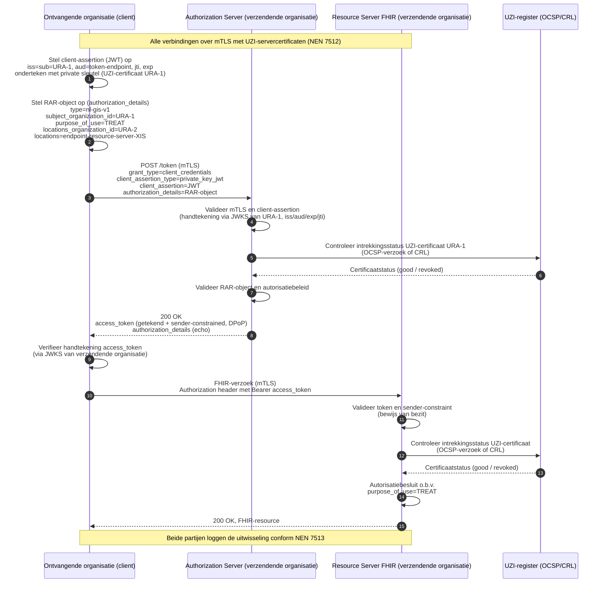

# Harmonisatie van authenticatie en autorisatie

**voor de gegevensuitwisselingen BgZ en eOverdracht**

*Status: concept ter bespreking — Datum: 13 juli 2026*

## 1. Inleiding

In de Nederlandse zorg moeten steeds meer medische gegevens digitaal uitgewisseld worden tussen zorgaanbieders. Twee belangrijke uitwisselingen zijn de Basisgegevensset Zorg (BgZ), waarmee medisch specialisten patiëntgegevens delen, en eOverdracht, de verpleegkundige overdracht. Beide zijn wettelijk verplicht onder de Wegiz en verlopen in toenemende mate over onderling verbonden technische infrastructuren.

Bij het beproeven van deze uitwisselingen bleek dat de technische afspraken voor de BgZ afwijken van die voor eOverdracht. Dat is onwenselijk: zorgaanbieders moeten dan twee vergelijkbare voorzieningen inrichten en per uitwisseling bepalen welke methode geldt. Dit is duurder en foutgevoeliger. Harmonisatie van authenticatie (betrouwbaar vaststellen of de identiteit daadwerkelijk bij de persoon of de organisatie hoort) en autorisatie (bepalen wat vanuit de identiteit uitgevoerd mag worden) is daarom een randvoorwaarde voor een interoperabele, efficiënte en veilige uitwisseling.

31 maart 2026 heeft het Ministerie van VWS een memo (escalatie) van Twiin ontvangen met de titel 'Overbrugging authenticatie eis voor landelijke databeschikbaarheid'. Deze notitie beantwoordt de drie vragen uit de memo, met nadruk op de korte termijn:

1) Hoe wordt authenticatie op zorgaanbieder-niveau vormgegeven, ook op lange termijn onder het
DEZI-stelsel?
2) Hoe kan authenticatie (zowel van zorgverlener als van zorgaanbieder) worden ingevuld in de (korte-
termijn) uitwerking van TA’s voor communicatiepatronen? Welke identificatie- en
authenticatiemethoden worden geaccepteerd voor de zorgverlener dan wel zorgaanbieder bij de
verschillende communicatiepatronen?
3) Welke risico’s worden met techniek afgedekt en welke worden met afspraken en overeengekomen
processen geborgd?

## 2. Afbakening

De nadruk van dit memo ligt op het komen tot duidelijkheid en oplossingen op de korte termijn. In scope is het verzenden van zorggegevens tussen twee zorgaanbieders binnen de BgZ en eOverdracht. Bij deze uitwisselingen gaat een verwijzing, overdracht of ‘aanmelding’ vooraf, bijvoorbeeld door telefonisch contact tussen zorgverleners. Er is daardoor bij de ontvangende organisatie sprake van een (startende) behandelrelatie. In deze situatie is er veronderstelde toestemming: de toestemming van de patiënt ligt al besloten in de instemming met de verwijzing. Een aparte toestemmingscontrole bij de verwijzende/verzendende zorgaanbieder is dan niet nodig en is daarmee buiten scope van deze memo.

Buiten scope is ook de autorisatie voor andere use cases, zoals een databevraging zonder voorafgaande verwijzing (geen veronderstelde toestemming) of uitwisseling die niet tussen twee zorgaanbieders verloopt (bijvoorbeeld vanuit een PGO of onderzoeksinstelling). De bevraging-use case wordt op hoofdlijnen geschetst in paragraaf 6, omdat de gekozen techniek daar goed op voorbereid is.

In het vervolg op deze stap zullen deze en andere buiten scope gehouden aspecten stapsgewijs uitgewerkt worden om tot landelijk opschaalbare digitale uitwisseling te komen.

## 3. Juridisch kader

Vanuit de wet (WGBO, AVG en Wabvpz) volgt het volgende kader voor de uitwisselingen die in scope van deze notitie vallen:

- **De bronhoudende zorgaanbieder is niet verantwoordelijk voor de authenticatie en autorisatie van zorgverleners of systemen bij een andere zorgaanbieder.** De AVG en de Wabvpz beleggen de plicht tot passende beveiliging en betrouwbare authenticatie van medewerkers en systemen bij iedere zorgaanbieder zelf, als zelfstandig verwerkingsverantwoordelijke. Een zorgaanbieder hoeft de authenticatie van de uitwisselingspartner dus niet over te doen en mag afgaan op diens verklaring.
- **De bronhoudende zorgaanbieder is wel verantwoordelijk voor de authenticatie en autorisatie van de andere zorgaanbieder waarmee data wordt uitgewisseld.** Over de organisatiegrens heen wordt uitsluitend de identiteit van de uitwisselingspartner (de andere zorgaanbieder) geverifieerd. Voor de autorisatie van de uitwisseling moet ook het doel of de grondslag voor de uitwisseling bekend zijn (voor eOverdracht en BgZ: 'uitvoering van de behandelingsovereenkomst'). 
- **Voor eOverdracht en BgZ-verwijzing is een (startende) behandelrelatie vereist, maar deze hoeft niet schriftelijk te zijn vastgelegd.** Voor eOverdracht en BgZ-verwijzing wordt gebruik gemaakt van de wettelijke grondslag uit de WGBO; 'noodzakelijk voor de uitvoering van de behandelingsovereenkomst'. Vanuit het juridische kader is het niet noodzakelijk om deze behandelovereenkomst of behandelrelatie schriftelijk vast te leggen. Het verifiëren van de patiënttoestemming voor de gegevensuitwisseling door de verwijzende zorgaanbieder is niet nodig, aangezien de toestemming van de patiënt al besloten ligt in de instemming met de verwijzing.

- **De bronhoudende zorgaanbieder is niet verantwoordelijk voor de authenticatie en autorisatie van zorgverleners of systemen bij een andere zorgaanbieder.** De AVG en de Wabvpz beleggen de plicht tot passende beveiliging en betrouwbare authenticatie van medewerkers en systemen bij iedere zorgaanbieder zelf, als zelfstandig verwerkingsverantwoordelijke. Een zorgaanbieder hoeft de authenticatie van de uitwisselingspartner dus niet over te doen en mag afgaan op diens verklaring.
- **De bronhoudende zorgaanbieder is wél verantwoordelijk voor de authenticatie en autorisatie van de andere zorgaanbieder waarmee data uitgewisseld wordt.** Over de organisatiegrens heen wordt uitsluitend de identiteit van de uitwisselingspartner (de andere zorgaanbieder) geverifieerd. Voor de autorisatie van de uitwisseling moet ook het doel of de grondslag voor de uitwisseling bekend zijn (voor eOverdracht en BgZ is de grondslag: ‘noodzakelijk voor uitvoering van de behandelingsovereenkomst’).
- **Voor eOverdracht en BgZ-verwijzing is een (startende) behandelrelatie vereist, maar deze hoeft niet schriftelijk te zijn vastgelegd.** Voor eOverdracht en BgZ-verwijzing wordt gebruik gemaakt van de wettelijke grondslag uit de WGBO. Vanuit het juridische kader is het niet noodzakelijk om deze behandelovereenkomst of behandelrelatie schriftelijk vast te leggen. Het verifiëren van de patiënttoestemming voor de gegevensuitwisseling door de verwijzende zorgaanbieder is niet nodig, aangezien de toestemming van de patiënt al besloten ligt in de instemming met de verwijzing.
- **De organisatie-identiteit van de zorgaanbieder is wettelijk verankerd in het UZI-register (Wabvpz).** Het URA-nummer (UZI-RegisterAbonneenummer) is de stelselbrede, unieke organisatie-identificatie en moet binnen beide uitwisselingen, eOverdracht en BgZ, worden gebruikt.

Dit juridisch kader leidt tot een federatief vertrouwensmodel: iedere zorgaanbieder is exclusief verantwoordelijk voor de authenticatie en autorisatie van de eigen zorgverleners en systemen binnen het eigen beveiligingsdomein. Bij uitwisseling tussen zorgaanbieders vertrouwt de (bronhoudende) zorgaanbieder de ‘interne’ authenticatie en autorisatie van de andere zorgaanbieder. Dat vertrouwen is niet vrijblijvend: het wordt afgedwongen via wettelijk verplichte normen (NEN 7510/7512/7513), toetredingseisen vooraf, audits en toezicht doorlopend, en logging en aansprakelijkheid achteraf. Met deze eisen voor logging (NEN 7513) en het inzagerecht van de patiënt (geregeld in de Wabvpz) moet achteraf te achterhalen zijn wie (welke zorgverlener) of welk systeem bij een andere zorgaanbieder gegevens heeft opgevraagd.

Na de inwerkingtreding van de Wet DIAZ moet voor de landelijk uniforme authenticatie van zorgverleners gebruik worden gemaakt van het Dezi-stelsel. Dit wijzigt de zorgaanbieder-interne authenticatie: Dezi stelt eisen aan het lokale inlogmiddel van de zorgverlener. Het raakt echter niet de verdeling van verantwoordelijkheid: de zorgaanbieder blijft zelf verantwoordelijk voor de werkrelatie met de zorgmedewerker en de toegang tot patiëntgegevens. De komst van Dezi heeft daarom geen effect op de zorgaanbieder-authenticatie of op de uitwisseling tussen zorgaanbieders; de uitwisselingspartner voert immers geen eigen authenticatie van zorgverleners uit (zie het federatieve model hierboven). De in deze notitie gekozen aanpak is hierop voorbereid, ook voor de lange termijn.

## 4. Eisen aan de technische implementatie

Uit het juridisch kader volgen de eisen die de techniek moet invullen:

1. **Wederzijds vaststellen van de identiteit van de zorgaanbieder.** Beide partijen stellen betrouwbaar vast met welke organisatie zij uitwisselen, op basis van het URA uit het UZI-register. Dit geldt ook als er een knooppunt of intermediair(s) namens een van de zorgaanbieders optreedt. Dit beperkt tevens het risico dat, bij verzenden van gegevens, deze bij de verkeerde partij terechtkomen. De gegevens mogen uitsluitend worden geleverd aan de vastgestelde zorgaanbieder.
2. **Geen authenticatie van individuele zorgverleners of systemen van de partner.** De techniek hoeft niet op persoons- of systeemniveau te controleren; zij draagt alleen de context mee die nodig is voor autorisatie, logging en herleidbaarheid op organisatieniveau.
3. **Expliciet meedragen van het doel van de uitwisseling.** De doelstelling moet expliciet worden benoemd, zodat deze te onderscheiden is van andere (later te ondersteunen) doelstellingen/grondslagen, en de bron er een autorisatiebesluit op kan baseren.

Naast het juridische kader worden de volgende uitgangspunten uit de GISA (Gezondheidsinformatiestelsel-Architectuur) overgenomen:

1. **Hergebruik van bestaande, bewezen oplossingen (GIS07, GIS03/HA3).** De GISA schrijft voor dat het stelsel bestaande passende oplossingen gebruikt (principe GIS07) en uitsluitend open, internationaal erkende standaarden hanteert (principe GIS03, hoofdkeuze HA3). Er wordt daarom hergebruik gemaakt van bewezen, internationaal beproefde standaarden in plaats van een stelselspecifieke oplossing.
2. **Voorsorteren op het GIS Veilig Netwerk (HA7).** De GISA schrijft vertrouwde netwerkverbindingen voor via het GIS Veilig Netwerk (GIS-VN-Basis), met mTLS-beveiliging op de transportlaag op basis van X509-certificaten (hoofdkeuze HA7; mTLS: mutual/wederzijdse Transport Layer Security). De (Veilig Netwerk-)certificaten zijn niet uitsluitend voor zorgaanbieder-identificatie bedoeld, maar ook, bijvoorbeeld, voor dienstverleners. Het transportcertificaat identificeert dus niet altijd de zorgaanbieder zelf.
3. **Scheiding van transport- en applicatievertrouwen (GIS02, keuze A44).** De GISA belegt het vertrouwen op de infrastructuurlaag (de netwerkverbinding) uitsluitend tussen de verantwoordelijken voor die verbinding; het vertrouwen tussen verzender en ontvanger van gezondheidsdata wordt op de applicatielaag geborgd (architectuurkeuze A44), aansluitend op de scheiding van inhoud en transport (principe GIS02). De organisatie-authenticatie wordt daarom bewust losgekoppeld van het transportcertificaat en op berichtniveau geborgd (zie hieronder).
4. **Toegangscontrole op basis van claims (HA5, keuzes A12/A13).** De GISA kiest voor Claims-Based Access Control (CBAC): toegangscontrole op basis van meegedragen claims. Het meesturen van de organisatie-identiteit (URA) en het doel van de uitwisseling als claims sluit hier direct op aan (zie de keuze voor een RAR-object hieronder).

## 5. Technische keuzes en onderbouwing

Bovenstaande eisen en uitgangspunten sturen de technische keuzes. De keuzes samengevat:

**OAuth 2.0 als basis.** OAuth 2.0 is de de-facto internationale standaard voor gecontroleerde toegang tussen systemen. Het wordt o.a. vanuit standaardisatie-organisaties als HL7 en IHE voorgeschreven en er is geen aanleiding om aan te nemen dat OAuth 2.0 niet ‘past’ in de context van de Nederlandse zorg.

**Aanvullende beveiligingsmaatregelen uit FAPI 2.0.** Het OAuth FAPI 2.0 profile is een beproefd, internationaal gedragen beveiligingsprofiel bovenop OAuth dat best practices bundelt. Het schrijft onder meer asymmetrische client-authenticatie voor (geen gedeelde geheimen, dus ‘private_key_jwt’ of ‘mTLS’), sender-constrained access tokens (via ‘DPoP’ of ‘mTLS’), verplichte transportbeveiliging en strikte token- en verzoekvalidatie (iss, aud, exp, unieke jti tegen replay). Dit profiel is oorspronkelijk ontwikkeld voor de financiële sector, maar wordt ook binnen de zorg (b.v. in Noorwegen) toegepast. De voorgeschreven beveiligingsmaatregelen van FAPI 2.0 worden breed ondersteund in bestaande autorisatie software.

**Client-credentials flow.** Bij de uitwisseling van data tussen zorgaanbieders is geen interactieve gebruiker aanwezig: de zorgverlener is al binnen het eigen domein geauthenticeerd en de uitwisseling verloopt systeem-tot-systeem. Verschillende zorg-specifieke OAuth profielen en FAPI 2.0 schrijven in deze situatie de OAuth client-credentials flow voor.

**Client-authenticatie via private_key_jwt (in plaats van een mTLS-clientcertificaat).** Volgend uit de scheiding van transport- en applicatievertrouwen wordt de zorgaanbieder niet geauthenticeerd op basis van het transportcertificaat, maar met een op berichtniveau ondertekende verklaring: private_key_jwt. Deze keuze is onafhankelijk van het transport en blijft daardoor overeind wanneer het Veilig Netwerk-certificaat de zorgaanbieder niet (uniek) identificeert of door een dienstverlener wordt beheerd. Daarnaast geniet private_key_jwt bij diverse dienstverleners de voorkeur boven mTLS-authenticatie en sluit het aan bij bestaande infrastructuur (zoals de Nuts-node), die publieke sleutels al via een web-endpoint publiceert. De transportlaag blijft, conform het uitgangspunt, beveiligd met mTLS; voorlopig op basis van UZI-servercertificaten (NEN 7512).

**Ondertekening van tokenverzoek én access token door de zorgaanbieder.** De identiteit van de zorgaanbieder wordt op berichtniveau geborgd met digitaal ondertekende tokens, gevalideerd via het (JSON Web Key Set-)web-endpoint van de afgevende organisatie. Omdat mTLS is losgelaten als authenticatiemiddel, is het ondertekenen van het access token noodzakelijk. Zo is de organisatie-identiteit (URA) cryptografisch verifieerbaar op elk punt in de keten en wordt het kernrisico afgedekt dat gegevens bij de verkeerde partij terechtkomen.

**Zorg-attributen in een RAR-object.** De client-credentials flow draagt van zichzelf geen zorg-specifieke informatie mee. Vanuit het juridisch kader is er een attribuut nodig voor het doel (de grondslag). Als we vooruit kijken naar andere use cases (zie paragraaf 6), zijn er nog meer aanvullende attributen nodig. FAPI 2.0 verwijst hiervoor naar Rich Authorization Requests (RAR, RFC 9396): in de parameter authorization_details wordt een uitbreidbare JSON-structuur meegegeven met per object een type en type-specifieke velden. Ook de locations (de resource server(s) waartoe toegang wordt gevraagd) is een standaard door RAR ondersteund attribuut. Alternatieven zoals de ‘IHE JWT IUA extension’ en het ‘FHIR UDAP B2B Authorization Extension Object’ specificeren het ‘purpose-of-use’ attribuut, maar binden dit aan een profiel-specifieke JWT-extensie; RAR is generiek en uitbreidbaar en voorkomt een nieuwe, stelselspecifieke extensie. IHE IUA noemt RAR zelf al als ontwikkelrichting.

Samengevat: OAuth 2.0 met FAPI 2.0-beveiligingsmaatregelen, de client-credentials-uitwisseling met private_key_jwt en de zorg-attributen in een RAR-object. De volledige flow staat als voorbeeld in de bijlage.

## 6. Vooruitblik: ondersteuning van de use case 'bevraging'

Bij een databevraging zonder voorafgaande verwijzing ontbreekt de grondslag van veronderstelde toestemming: bij de bronhoudende zorgaanbieder is er immers geen verwijzing bekend die naar de opvragende zorgaanbieder wijst (waaruit veronderstelde toestemming en behandelrelatie kunnen worden afgeleid). Ook hier zien wij hetzelfde model (geen zorgverlener in de uitwisseling, dezelfde OAuth/`private_key_jwt`/FAPI/mTLS-basis). Twee aanvullingen zijn naar verwachting nodig:

- **Toevoegen van het organisatietype aan het RAR-object.** Naast de organisatie-identiteiten (URA) en doel moet ook het organisatietype (van de verzendende zorgaanbieder) meereizen, zodat de bron een grondslag- en toestemmingscontrole kan uitvoeren richting Mitz (een bepaalde categorie zorgaanbieders mag medische gegevens van een bepaalde categorie zorgaanbieders alleen met toestemming opvragen). Omdat RAR uitbreidbaar is, past dit zonder nieuwe techniek.
- **Aanvullende securitymaatregel voor toetsing van de behandelrelatie.** Omdat de behandelrelatie niet uit een voorafgaande verwijzing kan worden afgeleid, kan voor informatiebeveiligingsdoeleinden een aanvullende maatregel nodig zijn, om de behandelrelatie op het moment van opvragen vast te stellen en te borgen, afhankelijk van de zorgtoepassing. De precieze wijze waarop de behandelrelatie wordt afgeleid of vastgesteld, vraagt een eigen analyse en uitwerking.

Ook andere doelstellingen of grondslagen dan ‘behandeling’ kunnen met hetzelfde autorisatieprotocol worden geïmplementeerd door het purpose_of_use-attribuut in het RAR-object een andere waarde te geven. Bijvoorbeeld voor spoed/vitaal-belang, een bevraging vanuit de burger/PGO of een bevraging in het kader van (medisch-wetenschappelijk) onderzoek. Per doelstelling gelden eigen grondslag- en toestemmingsvereisten, die per geval in het vervolgtraject zullen worden uitgewerkt.

## 7. Conclusie

De BgZ- en eOverdracht-uitwisselingen worden geharmoniseerd op basis van één federatief vertrouwensmodel. Iedere zorgaanbieder authenticeert de eigen zorgverleners en systemen binnen het eigen domein; over de organisatiegrens heen wordt uitsluitend de organisatie-identiteit (URA) geverifieerd, via ondertekende tokens en een (voorlopig) met UZI-servercertificaten beveiligde verbinding. De risico’s worden gedeeltelijk buiten de transactie afgedekt: vooraf via toetredingseisen, doorlopend via audits en toezicht, en achteraf via logging en juridische aansprakelijkheid. De technische invulling steunt volledig op bestaande internationale standaarden (OAuth 2.0, FAPI 2.0, RAR) en is voorbereid op uitbreiding naar andere use cases.

## Bijlage: Voorbeeld van de technische flow

Het RAR-object dat met het tokenverzoek wordt meegestuurd, ziet er conceptueel als volgt uit:
{
  "authorization_details": [
    {
      "type": "nl-gis-v1",
      "purpose_of_use": "http://terminology.hl7.org/CodeSystem/v3-ActReason|TREAT",
      "locations": ["https://fhir.zorgaanbieder-b.nl/fhir"],
      "locations_organization_id": "urn:oid:2.16.528.1.1007.3.3.12345678"
    }
  ]
}

Voor de bevraging-use case (paragraaf 6) wordt hier het organisatietype aan toegevoegd:
{
  "authorization_details": [
    {
      "type": "nl-gis-v1",
      "subject_organisation_type": "https://www.cbs.nl/standaard-bedrijfsindeling|8610",
      "purpose_of_use": "http://terminology.hl7.org/CodeSystem/v3-ActReason|TREAT",
      "locations": ["https://fhir.zorgaanbieder-b.nl/fhir"],
      "locations_organization_id": "urn:oid:2.16.528.1.1007.3.3.12345678"
    }
  ]
}

De volledige flow verloopt als volgt:

Zowel de client-assertion in het tokenverzoek als het access token worden ondertekend met de sleutel behorend bij het UZI-certificaat van de afgevende organisatie; de ontvanger valideert de handtekening via het JWKS-endpoint van die organisatie. Daarmee is alleen de organisatie-identiteit (URA) cryptografisch verifieerbaar; het doel (en, bij bevraging, het organisatietype) reist mee als verklaring van de ontvangende organisatie, die daarvoor verantwoordelijk en aansprakelijk is.
