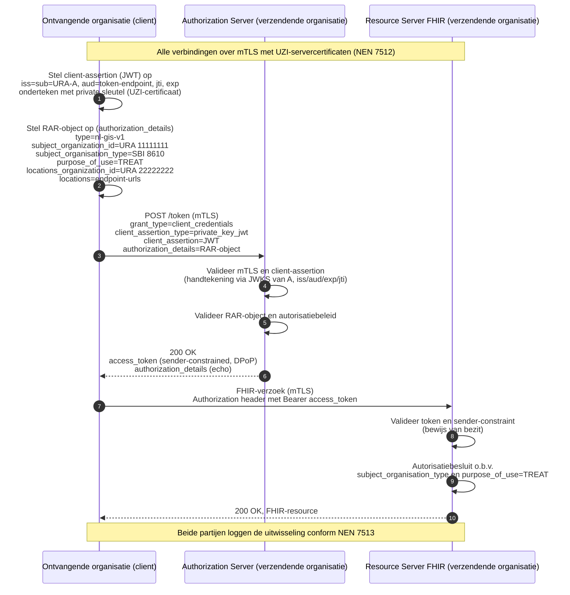

# Harmonisatie van authenticatie en autorisatie

**voor de gegevensuitwisselingen BgZ en eOverdracht**

*Status: concept ter bespreking — Datum: 8 juli 2026*

## 1. Inleiding

### 1.1 Aanleiding

In de Nederlandse zorg worden steeds meer medische gegevens digitaal uitgewisseld tussen zorgaanbieders, zoals ziekenhuizen, verpleeghuizen en thuiszorgorganisaties. Twee belangrijke uitwisselingen zijn de Basisgegevensset Zorg (BgZ), waarmee medisch specialisten patiëntgegevens met elkaar delen, en eOverdracht, de verpleegkundige overdracht. Voor beide uitwisselingen geldt een wettelijk verplichtingstraject onder de Wegiz en beide verlopen in toenemende mate over dezelfde technische infrastructuur.

Deze notitie gaat over het verzenden van zorggegevens tussen zorgaanbieders binnen de BgZ en eOverdracht. Beide uitwisselingen betreffen uitsluitend de overdracht van patiëntgegevens nadat er mogelijk langs andere weg al contact is geweest tussen de verzendende en de ontvangende organisatie, waardoor bij de ontvangende organisatie sprake is van een (startende) behandelrelatie. Dit contact hoeft niet schriftelijk te worden vastgelegd, maar levert niettemin voldoende grondslag op voor de gegevensuitwisseling: de toestemming van de patiënt ligt al besloten in diens instemming met de verwijzing of overdracht zelf. In deze situaties hoeft dan ook geen aparte toestemmingscontrole te worden uitgevoerd. Bij deze uitwisselingen mag uitgegaan worden van veronderstelde toestemming.

Bij het beproeven van de technische afspraken is geconstateerd dat de afspraken voor de BgZ afwijken van die voor de eOverdracht. Dat is onwenselijk, zorgaanbieders moeten dan twee keer vergelijkbare voorzieningen inrichten en per uitwisseling bepalen welke methode ze moeten gebruiken. Dit is duurder en geeft meer kans op fouten. Harmonisatie van authenticatie (het betrouwbaar vaststellen wie iemand is of om welke organisatie het gaat) en autorisatie (het bepalen wat iemand / een organisatie mag) is daarom een randvoorwaarde voor een interoperabele, efficiënte en veilige implementatie van beide uitwisselingen.

31 maart 2026 heeft het Ministerie van VWS een memo (escalatie) van Twiin ontvangen met de titel 'Overbrugging authenticatie eis voor landelijke databeschikbaarheid'. Hierin wordt gesteld dat nog geen overeenstemming is bereikt over de vraag hoe de NEN-norm 7512 moet worden geïnterpreteerd en welke vormen van zorgverlener-authenticatie noodzakelijk zijn. Ook is het nog onduidelijk op welke manier zorgaanbieder-authenticatie ingericht moet worden.

Deze notitie is geschreven om in beide vraagstukken duidelijkheid te verschaffen.

### 1.2 Vraagstelling

In de Memo van 31 maart 2026 staan de volgende vragen:

1. Hoe wordt authenticatie op zorgaanbieder-niveau vormgegeven, ook op lange termijn onder het DEZI-stelsel?
2. Hoe kan authenticatie (zowel van zorgverlener als van zorgaanbieder) worden ingevuld in de (korte termijn) uitwerking van TA’s voor communicatiepatronen? Welke identificatie- en authenticatiemethoden worden geaccepteerd voor de zorgverlener dan wel zorgaanbieder bij de verschillende communicatiepatronen?
3. Welke risico’s worden met techniek afgedekt en welke worden met afspraken en overeengekomen processen geborgd?

Bovenstaande vragen zijn voor deze notitie vertaald naar de volgende drie vragen.

1. Hoe wordt de authenticatie van zorgverleners en zorgsystemen geharmoniseerd (interne authenticatie en autorisatie)?
2. Hoe wordt de authenticatie van zorgaanbieders geharmoniseerd (externe authenticatie en autorisatie)?
3. Hoe worden de risico's in het vertrouwensmodel juridisch, organisatorisch en technisch afgedekt?

Bij de beantwoording van deze vragen richt dit document zich vooral op de korte termijn. Om de uitwisselingen van de BgZ en eOverdracht zo snel mogelijk landelijk beschikbaar te maken, moet rekening worden gehouden met de beschikbare oplossingen, die voor het grootste gedeelte van de zorgaanbieders met beperkte inspanning in te richten zijn. Wel wordt zo veel mogelijk rekening gehouden met toekomstige implementaties, waarover al informatie beschikbaar is.

### 1.3 Leeswijzer

Hoofdstuk 2 definieert de gebruikte begrippen en afkortingen. Hoofdstuk 3 beschrijft het wettelijk kader en het onderscheid tussen interne en externe authenticatie; dat onderscheid is bepalend voor de rest van het document. Hoofdstuk 4 introduceert het kernprincipe: het federatieve vertrouwensmodel. De hoofdstukken 5 tot en met 7 beantwoorden de drie vragen. Hoofdstuk 8 beschrijft hoe de gekozen aanpak technisch wordt ingevuld met bestaande internationale standaarden. De normatieve eisen (requirements) waaraan zorgaanbieders moeten voldoen, zijn opgenomen in bijlage A.

## 2. Begrippen en afkortingen

Onderstaande tabel licht de belangrijkste begrippen toe zoals ze in deze notitie worden gebruikt.

| Begrip | Toelichting |
|---|---|
| Authenticatie | Het betrouwbaar vaststellen van de identiteit van een persoon, systeem of organisatie. |
| Autorisatie | Het bepalen of een geauthenticeerde partij toegang krijgt tot bepaalde gegevens. |
| BgZ | Basisgegevensset Zorg: een standaardset patiëntgegevens die medisch specialisten onderling uitwisselen. |
| eOverdracht | De gestandaardiseerde verpleegkundige overdracht van een patiënt tussen zorgaanbieders. |
| Wegiz | Wet elektronische gegevensuitwisseling in de zorg: verplicht stapsgewijs dat gegevensuitwisselingen elektronisch en volgens standaarden verlopen. |
| AVG | Algemene verordening gegevensbescherming: de Europese privacywet. |
| Wabvpz | Wet aanvullende bepalingen verwerking persoonsgegevens in de zorg: regelt onder meer het UZI-register, logging en het inzagerecht van de patiënt. |
| NEN 7510 / 7512 / 7513 | Nederlandse normen voor informatiebeveiliging in de zorg: respectievelijk het beveiligingsmanagement, veilige verbindingen tussen organisaties en de logging van toegang tot dossiers. |
| IAM | Identity & Access Management: het geheel van processen waarmee een organisatie identiteiten en toegangsrechten van medewerkers en systemen beheert. |
| UZI-register | Wettelijk register van zorgaanbieders en zorgverleners, beheerd door het CIBG (een uitvoeringsorganisatie van het ministerie van VWS). Het register geeft ook certificaten uit. |
| URA | UZI-registerabonneenummer: het unieke nummer waarmee een zorgaanbieder als organisatie herkenbaar is in het zorgstelsel. |
| Certificaat | Digitaal bewijsstuk waarmee een systeem of organisatie zijn identiteit aantoont; een UZI-servercertificaat is zo'n certificaat, uitgegeven via het UZI-register. |
| mTLS | Wederzijdse TLS: een beveiligde verbinding waarbij beide partijen zich met een certificaat identificeren. |
| Token (JWT) | Digitaal ondertekend bewijsstuk dat met een bericht wordt meegestuurd en informatie over de afzender en het doel bevat. |
| JWKS | JSON Web Key Set: een publicatiepunt waar een organisatie haar publieke sleutels aanbiedt, zodat ontvangers de handtekening op tokens kunnen controleren. |
| OAuth 2.0 | Internationale standaard voor het veilig verlenen van toegang tussen systemen. |
| FHIR | Internationale standaard voor het digitaal uitwisselen van zorggegevens. |
| Dezi / Wet DIAZ | Beoogd landelijk inlogmiddel voor zorgmedewerkers en de bijbehorende wet (in voorbereiding). |
| eIDAS | Europese verordening over elektronische identificatie; definieert betrouwbaarheidsniveaus (laag, substantieel, hoog) voor inlogmiddelen van personen. |
| Knooppunt / intermediair | Dienstverlener die de technische uitwisseling namens een zorgaanbieder verzorgt. |
| Organisatie | Een zorgorganisatie (zorgaanbieder) die aan de uitwisseling deelneemt. |
| Verzendende organisatie | De organisatie die de patiëntgegevens beschikbaar stelt en levert; zij houdt het dossier en beoordeelt inkomende verzoeken (de bron). |
| Ontvangende organisatie | De organisatie die de patiëntgegevens opvraagt en ontvangt. |
| Verzendend systeem | Het (EPD-/ECD-)systeem van de verzendende organisatie. |
| Ontvangend systeem | Het (EPD-/ECD-)systeem van de ontvangende organisatie. |
| Verwerkingsverantwoordelijke | De partij die volgens de AVG verantwoordelijk is voor de verwerking van persoonsgegevens. |
| Behandelrelatie | De zorgrelatie tussen zorgverlener en patiënt die toegang tot het dossier rechtvaardigt. |
| Verifiable Credentials / EUDI-wallet | Opkomende Europese techniek waarmee organisaties en personen digitale bewijzen kunnen tonen; nog in ontwikkeling. |

## 3. Wettelijk kader

Voor het vervolg is één onderscheid essentieel, namelijk dat tussen interne en externe authenticatie. Interne authenticatie speelt zich af binnen de muren van één zorgaanbieder: het bewijzen van de identiteit van de eigen medewerkers en systemen. Externe authenticatie speelt zich af tussen zorgaanbieders: het over en weer vaststellen met welke organisatie gegevens worden uitgewisseld. De wet stelt aan beide vormen van authenticatie verschillende eisen.

### 3.1 Interne authenticatie

De AVG en de Wabvpz leggen de plicht tot passende beveiliging en betrouwbare authenticatie van medewerkers en systemen bij iedere zorgaanbieder zelf, als zelfstandig verwerkingsverantwoordelijke. Die verantwoordelijkheid rust dus uitdrukkelijk op de organisatie die de zorgverlener of het systeem beheert, niet op een andere organisatie waarmee gegevens worden uitgewisseld. Om drie samenhangende redenen is het niet nodig, en ook niet wenselijk, dat de verzendende organisatie deze interne authenticatie nog eens overdoet of zelfstandig controleert:

1. **Geen wettelijke opdracht.** De wet belegt de authenticatieplicht eenduidig bij de zorgaanbieder die de zorgverlener of het systeem beheert. Nergens wordt van de verzendende organisatie gevraagd deze te herhalen of te verifiëren. Dat zou namelijk een tweede, wettelijk niet-voorziene verantwoordelijkheid creëren voor iets waarop zij geen zeggenschap heeft.
2. **Geen toegevoegde betrouwbaarheid.** De verzendende organisatie heeft geen toegang tot de identiteits- en autorisatievoorzieningen (IAM) van de ontvangende organisatie. Een eigen controle zou dus in alle gevallen moeten steunen op diezelfde bron: de interne administratie van de ontvangende organisatie. Dat voegt geen zekerheid toe, maar wel complexiteit en een tweede plek waar iets fout kan gaan.
3. **Strijdig met dataminimalisatie.** Om zelf te kunnen verifiëren, zou de verzendende organisatie toegang moeten krijgen tot persoonsgegevens van medewerkers van de ontvangende organisatie, bijvoorbeeld een overzicht van geautoriseerde zorgverleners. Dat gaat verder dan noodzakelijk voor het doel van de uitwisseling en is daarmee in strijd met het AVG-beginsel van dataminimalisatie.

In plaats van een eigen controle toont iedere zorgaanbieder de betrouwbaarheid van zijn interne processen aantoonbaar aan via het verplichte normenkader van NEN 7510 (informatiebeveiliging) en NEN 7512 (veilige verbindingen tussen organisaties). De verzendende organisatie mag op die aantoonbare naleving vertrouwen, zonder dit zelf te hoeven controleren. Dit vertrouwen-op-normen in plaats van vertrouwen-op-eigen-controle is het uitgangspunt dat in hoofdstuk 4 wordt uitgewerkt tot het federatieve vertrouwensmodel.

Voor de betrouwbaarheid van het inlogmiddel waarmee de individuele zorgverlener zich binnen dit interne proces identificeert, vormt de eIDAS-verordening het Europese referentiekader: deze definieert betrouwbaarheidsniveaus (laag, substantieel, hoog) voor inlogmiddelen van personen. Op dit moment is niveau hoog vereist voor de verwerking van de BgZ en eOverdracht (zie paragraaf 7.2). Het eIDAS-niveau is een aanvulling op de NEN 7510-eisen aan het onderliggende IAM-proces, niet een vervanging ervan. Ook dit blijft, net als de authenticatie zelf, een interne aangelegenheid: de verzendende organisatie controleert niet welk eIDAS-niveau daadwerkelijk is gebruikt, maar vertrouwt erop dat de ontvangende organisatie het afgesproken niveau hanteert. Dit onderscheid is van belang omdat eIDAS uitdrukkelijk niet van toepassing is op de authenticatie van de zorgaanbieder als organisatie (zie paragraaf 3.2).

Na de inwerkingtreding van de Wet DIAZ moet gebruikgemaakt worden van Dezi voor landelijk uniforme authenticatie van zorgverleners, met een inlogmiddel dat aan een eIDAS-betrouwbaarheidsniveau voldoet. Ook bij het gebruiken van het Dezi-stelsel blijft de zorgaanbieder zelf verantwoordelijk voor de werkrelatie met de zorgmedewerker en de toegang tot patiëntgegevens. Dezi vervangt alleen het lokale inlogmiddel, niet de verdeling van verantwoordelijkheid. De komst van Dezi verandert dus niets aan het uitgangspunt dat de verzendende organisatie geen eigen authenticatie van zorgverleners uitvoert. De in deze notitie gekozen aanpak is daarop voorbereid, ook voor de lange termijn.

### 3.2 Externe authenticatie

De identiteit van de zorgaanbieder als organisatie is wettelijk verankerd in het UZI-register (Wabvpz). Het daaraan gekoppelde abonneenummer (URA) fungeert als de stelselbrede, unieke organisatie-identificatie. Binnen deze uitwisseling van de BgZ en binnen eOverdracht kan gebruikgemaakt worden van dit middel.

Daarbij past een begripsafbakening: de eIDAS-betrouwbaarheidsniveaus zijn gedefinieerd voor inlogmiddelen van personen en zijn niet van toepassing op certificaten waarmee systemen zich authenticeren. De betrouwbaarheid van de organisatieauthenticatie wordt dus niet uitgedrukt in een eIDAS-niveau, maar ontleend aan het gecontroleerde uitgifteproces van het UZI-register en de PKIoverheid-eisen, in combinatie met NEN 7512 voor de eisen aan de verbinding.

## 4. Kernprincipe: het federatieve vertrouwensmodel

Dit hoofdstuk beschrijft het ontwerpprincipe waarop alle antwoorden in deze notitie zijn gebaseerd.

### 4.1 Het probleem: wie vertrouw je, en op basis waarvan?

Wanneer een verzendende organisatie gegevens deelt met een ontvangende organisatie, moet de verzendende organisatie een grondslag hebben om op te vertrouwen voordat de gegevens worden vrijgegeven. Dat vertrouwen kan op twee manieren worden ingevuld:

1. **Controle tot op het niveau van de individuele medewerker.** De verzendende organisatie stelt vast welke zorgverlener van de ontvangende organisatie de gegevens opvraagt, met welk inlogmiddel dit gebeurt en of die persoon daartoe bevoegd is. Dit vereist toegang tot (delen van) het personeels- en inlogsysteem van de ontvangende organisatie.
2. **Controle uitsluitend op organisatieniveau, met vertrouwen op het interne proces van de ontvangende organisatie.** De verzendende organisatie stelt uitsluitend vast dat het verzoek daadwerkelijk van de ontvangende organisatie afkomstig is, en gaat ervan uit dat die organisatie haar eigen medewerkers al betrouwbaar heeft geauthenticeerd en geautoriseerd.

De eerste manier lijkt op voorhand veiliger, maar is in de praktijk niet haalbaar. Zorgaanbieders hanteren elk hun eigen wijze van authenticatie en autorisatie, en ook de rollen en de toekenning daarvan aan zorgmedewerkers en systemen verschillen. Het onderling afstemmen van deze gegevens tussen duizenden zorgaanbieders is daarom niet uitvoerbaar. VWS kiest om die reden voor de tweede manier: het **federatieve vertrouwensmodel**.


### 4.2 Wat "federatief" hier betekent

De term is ontleend aan een federatie van staten, zoals de EU. Ter illustratie: elke lidstaat bepaalt zelf wie een paspoort krijgt en hoe dat wordt gecontroleerd, maar de andere lidstaten accepteren dat paspoort zonder zelf de identiteit van de houder opnieuw na te trekken; zij vertrouwen erop dat het land van uitgifte zijn interne processen deugdelijk heeft ingericht.

Hetzelfde principe geldt hier: iedere zorgaanbieder is exclusief verantwoordelijk voor de identificatie en authenticatie van zijn eigen zorgverleners en systemen, binnen zijn eigen beveiligingsdomein (zie paragraaf 3.1). Bij een uitwisseling controleert de verzendende organisatie dus níet welke individuele medewerker of welk systeem bij de ontvangende organisatie actief is, maar vertrouwt erop dat de ontvangende organisatie dit zelf betrouwbaar heeft geregeld. Over de grens tussen beide organisaties heen wordt uitsluitend de identiteit van de ontvangende organisatie zelf geverifieerd (zie paragraaf 3.2) — ter illustratie vergelijkbaar met het controleren van een paspoort aan de grens, zonder dat het volledige dossier van de houder wordt opgevraagd.

### 4.3 Waar het vertrouwen dan wel op rust

Dit betekent niet dat er minder wordt gecontroleerd; de controle vindt vooral op een ander niveau plaats:

- **De niet-gekozen route: vertrouwen op het middel.** Zelf controleren of de individuele persoon aan de andere kant met een geldig, sterk inlogmiddel is ingelogd.
- **De gekozen route: vertrouwen op het proces.** Niet het inlogmiddel van de individuele persoon controleren, maar vertrouwen op het feit dat de andere organisatie een aantoonbaar goed ingericht IAM-proces heeft (Identity & Access Management, zie hoofdstuk 2), zodat zij haar eigen medewerkers en systemen zelf beheerst.

Dat vertrouwen is nadrukkelijk niet vrijblijvend en berust niet op enkel goede wil. Het wordt afgedwongen via geharmoniseerde afspraken en wettelijk verplichte normen: toetredingseisen vooraf, audits en toezicht doorlopend, en logging achteraf (zie hoofdstuk 7). Een zorgaanbieder mag pas deelnemen aan de uitwisseling nadat is aangetoond dat zijn interne proces aan de eisen voldoet, en dat wordt daarna doorlopend bewaakt.

### 4.4 De bouwstenen van het vertrouwensmodel

Het federatieve vertrouwensmodel bestaat niet uit één stap, maar uit een samenhangend geheel van zeven bouwstenen:

- **Identificatie**: vaststellen wie of welke organisatie iemand zegt te zijn (bijvoorbeeld via het URA-nummer).
- **Authenticatie**: het bewijs dat die identiteit ook klopt (bijvoorbeeld met een certificaat of een inlogmiddel).
- **Autorisatie**: vaststellen of de geïdentificeerde en geauthenticeerde entiteit toegang mag krijgen tot de gevraagde gegevens.
- **Behandelrelatie**: de zorgrelatie tussen zorgverlener en patiënt die toegang tot het dossier rechtvaardigt binnen de eigen zorgaanbieder.
- **Patiënttoestemming** — de toestemming die de patiënt voor de uitwisseling moet geven, of het ontbreken van bezwaar.
- **Logging** — het vastleggen van wie (de zorgmedewerker of organisatie), wanneer en met welk doel toegang heeft gehad, zodat dit achteraf gecontroleerd kan worden.
- **Transparantie** — inzage in de verwerkingen van de patiëntgegevens door de patiënt zelf.

Identificatie, authenticatie en autorisatie vormen de kern van deze notitie en worden uitgewerkt in de hoofdstukken 5 en 6. Behandelrelatie, patiënttoestemming, logging en transparantie komen terug in hoofdstuk 7, waar wordt beschreven hoe al deze bouwstenen samen geborgd worden langs drie sporen: juridisch, organisatorisch en technisch.

### 4.5 Wat dit betekent voor de rest van dit document

Dit principe verklaart de opbouw van de hoofdstukken die volgen:

- Hoofdstuk 5 werkt de interne kant uit: hoe een zorgaanbieder zijn eigen zorgverleners en systemen authenticeert (optie 2 hierboven, de kant van de eigen organisatie).
- Hoofdstuk 6 werkt de organisatiekant uit: hoe zorgaanbieders elkaar over de grens heen herkennen (het "paspoort controleren aan de grens").
- Hoofdstuk 7 werkt uit hoe het vertrouwen in elkaars interne proces geborgd wordt, ondanks dat je dat proces zelf niet controleert.

## 5. Vraag 1: Hoe wordt op korte termijn de authenticatie van zorgverleners en zorgsystemen geharmoniseerd (interne authenticatie en autorisatie)?

Dit hoofdstuk beantwoordt de eerste vraag: hoe wordt de interne authenticatie op korte termijn geharmoniseerd? Het antwoord volgt direct uit het federatieve principe van hoofdstuk 4.

Een zorgaanbieder richt een intern authenticatie- en autorisatieproces in dat voor alle uitwisselingen wordt gebruikt. In de context van deze notitie geldt dit voor zowel de BgZ als de eOverdracht, maar de bedoeling is dat dit proces in de toekomst gebruikt wordt voor alle uitwisselingen. De zorgverlener logt eenmalig in binnen het lokale beveiligingsdomein (conform NEN 7510). De zorgaanbieder staat er als organisatie voor in dat degene die de uitwisseling initieert een geauthenticeerde, geautoriseerde medewerker met een geldige behandelrelatie is. Hetzelfde geldt voor zorgsystemen (zoals het EPD of ECD): het beheer, de registratie en de authenticatie daarvan vallen onder het interne beheerproces van de zorgaanbieder die eigenaar is van deze systemen en verwerkingsverantwoordelijke voor de verwerking van de gegevens.

### 5.1 Applicatief niveau: welke informatie reist mee

Omdat de verzendende organisatie geen controle op persoons- of systeemniveau uitvoert, volstaat het dat elke transactie de context meedraagt die nodig is voor autorisatie, logging en herleidbaarheid op organisatieniveau. Dat zijn drie attributen: de organisatie-identiteit (URA), het doel van de opvraging (bijvoorbeeld 'behandeling') en het organisatietype (nodig voor de toestemmingscontrole).

Deze attributen worden meegegeven als verklaring van de ontvangende organisatie, niet als te verifiëren bewijs. De verzendende organisatie gebruikt ze uitsluitend voor het autorisatiebesluit en legt ze vast in de logging. Zij valideert niet zelf de onderliggende authenticatie. Doordat BgZ en eOverdracht dezelfde attributenset en hetzelfde verklaringsformaat hanteren, is het autorisatie- en loggingsproces bij de bron voor beide uitwisselingen identiek.

### 5.2 Transportniveau: wat de verzendende organisatie controleert

De verzendende organisatie controleert uitsluitend dat de verklaring afkomstig is van een geauthenticeerde organisatie, niet de juistheid van de inhoud. Hoe de ontvangende organisatie het interne inloggen technisch invult (wachtwoord met MFA, smartcard, UZI-pas, single sign-on vanuit het EPD/ECD) is een lokale keuze binnen de normkaders en is voor de verzendende organisatie niet zichtbaar en niet relevant. Dit maakt de aanpak direct toepasbaar in de BgZ en eOverdracht. De verwachting is dat een toekomstige migratie richting Dezi hier geen verandering in brengt.

## 6. Vraag 2: Hoe wordt op korte termijn de authenticatie van zorgaanbieders geharmoniseerd (externe authenticatie en autorisatie)?

Dit hoofdstuk beantwoordt de tweede vraag: hoe stellen organisaties over en weer vast met wie zij uitwisselen? De basis is het UZI-register. Het URA-nummer is de enige organisatie-identificatie en voor de authenticatie wordt een UZI-servercertificaat gebruikt. De borging vindt plaats op twee niveaus: op berichtniveau (het applicatieve niveau) en op verbindingsniveau (het transportniveau).

Het centrale risico bij het versturen van data is dat gegevens bij de verkeerde partij terechtkomen: de verzendende organisatie zou gegevens kunnen vrijgeven aan een andere dan de bedoelde organisatie. Dit risico wordt gemitigeerd doordat de ontvangende organisatie het access token laat ondertekenen met de sleutel van haar UZI-certificaat (zie paragraaf 6.1 en 8.6). De verzendende organisatie valideert die handtekening via het JWKS-endpoint van de ontvangende organisatie voordat zij gegevens vrijgeeft, en levert de gegevens uitsluitend aan de zo cryptografisch vastgestelde organisatie.

### 6.1 Applicatief niveau: ondertekende tokens

De organisatie-identiteit (URA) wordt in beide uitwisselingen op dezelfde plaats in de transactie meegegeven en gevalideerd. In de communicatie tussen twee zorgaanbieders kunnen deze partijen gebruikmaken van software die aangeboden wordt door leveranciers. Deze worden hier intermediairs genoemd. Waar een knooppunt of intermediair optreedt als technisch vertegenwoordiger, blijft de zorgaanbieder zelf de geïdentificeerde en verantwoordelijke partij. De oorspronkelijke organisatie-identiteit moet in de gehele communicatieketen worden meegestuurd en mag niet worden vervangen door die van de intermediair. Hierdoor kan de identiteit van de zorgaanbieder worden gecontroleerd op elk punt in de communicatieketen, ook bij de verzendende organisatie.

De identiteit van een zorgaanbieder wordt op berichtniveau geborgd via digitaal ondertekende tokens. Iedere zorgaanbieder publiceert de eigen publieke sleutels op een publiek beschikbare locatie, een JWKS-endpoint genoemd. De verzendende organisatie haalt die sleutels op en controleert daarmee dat het token daadwerkelijk door de geclaimde organisatie is afgegeven en onderweg niet is gewijzigd.

### 6.2 Transportniveau: beveiligde verbinding (mTLS)

De verbinding zelf wordt beveiligd met wederzijdse TLS (mTLS) op basis van UZI-servercertificaten, uitgegeven door het CIBG. Dit borgt de authenticatie van de organisatie op verbindingsniveau (NEN 7512) en is op dit moment het enige beschikbare middel voor systeem-tot-systeemauthenticatie op voldoende betrouwbaarheidsniveau. Op langere termijn kunnen deze certificaten worden vervangen door LDN-Veilig Netwerk-certificaten, die niet van de verantwoordelijke zorgaanbieder zelf zijn. Dat vooruitzicht is mede de reden om de organisatie-authenticatie niet aan het transportcertificaat op te hangen, maar aan de ondertekende tokens van paragraaf 6.1 (zie ook paragraaf 8.3).

## 7. Vraag 3: Hoe worden de risico's in het vertrouwensmodel juridisch, organisatorisch en technisch afgedekt?

### 7.1 De ontwerpbeslissing en het kernrisico

Het federatieve vertrouwensmodel, zoals besproken in hoofdstuk 4, rust op één expliciete ontwerpbeslissing: de verzendende organisatie verifieert bij uitwisseling niets op het niveau van de individuele zorgverlener of het individuele systeem van de ontvangende organisatie, maar vertrouwt op diens interne processen. De verzendende organisatie, op wie de geheimhoudingsplicht rust, deelt gegevens met de ontvangende organisatie en ontleent haar zekerheid dus aan de authenticatie en autorisatie die daar hebben plaatsgevonden.

Het kernrisico volgt direct uit die beslissing: een tekortschietend intern proces bij één zorgaanbieder werkt door in de vertrouwelijkheid van dossiers bij alle organisaties waarmee wordt uitgewisseld, zonder dat die dit in de transactie kunnen detecteren. De borging moet daarom volledig buiten de transactie worden georganiseerd, op drie momenten:

1. vooraf: registratie in het UZI-register en toetredingseisen;
2. doorlopend: toezicht, audits en beheer;
3. achteraf: herleidbaarheid en aansprakelijkheid.

De onderdelen van het vertrouwensmodel (identificatie, authenticatie, autorisatie, behandelrelatie, patiënttoestemming, logging en transparantie) worden langs deze drie momenten afgedekt via drie sporen: juridisch, organisatorisch en technisch.


### 7.2 Juridisch spoor

Iedere zorgaanbieder is en blijft zelfstandig verwerkingsverantwoordelijke (AVG) voor de verwerking in de eigen systemen, inclusief het knooppunt of de intermediair die namens hem optreedt, en is het aanspreekpunt voor patiënten bij de uitoefening van de privacyrechten van de patiënt. Het federatieve model verschuift die verantwoordelijkheid niet, maar maakt haar scherp belegbaar: omdat de verzendende organisatie uitsluitend afgaat op verklaringen van de ontvangende organisatie, is die ontvangende organisatie juridisch volledig aansprakelijk voor de juistheid daarvan.

De verplichtingen uit de Wabvpz rond logging en het inzagerecht van de patiënt gelden onverkort aan beide zijden en vormen de juridische basis voor de herleidbaarheid achteraf. Het juridisch spoor bewaakt ten slotte de zuiverheid van de betrouwbaarheidskaders in het vertrouwensmodel: organisatieauthenticatie steunt op het wettelijke uitgifteproces van het UZI-register, terwijl voor de lokale authenticatie van zorgverleners een afgesproken eIDAS-betrouwbaarheidsniveau als norm geldt.

### 7.3 Organisatorisch spoor

Het organisatorisch spoor borgt dat een zorgaanbieder de processen waarop anderen vertrouwen daadwerkelijk op het vereiste niveau heeft en houdt, langs dezelfde drie momenten als in paragraaf 7.1.

**Vooraf** moet iedere zorgaanbieder aantonen dat hij aan de toetredingseisen voldoet. Belangrijke voorwaarden zijn onder meer:

- aantoonbare conformiteit aan NEN 7510, met een IAM-proces dat zowel medewerker- als systeemidentiteiten omvat;
- een ingericht proces om de private sleutels waarmee verklaringen worden ondertekend vertrouwelijk te houden, en om de bijbehorende publieke sleutels te publiceren (JWKS-endpoint);
- en een betrouwbaar vastgestelde organisatie-identiteit (URA), gekoppeld aan het technische aansluitpunt.

Deze toetredingseisen zijn vooraf voor alle deelnemers kenbaar. Dat is de transparantie waarmee iedere deelnemer weet op welke afspraken de anderen mogen vertrouwen en waaraan hij zelf gehouden is.

**Doorlopend** wordt gecontroleerd of een zorgaanbieder aan deze eisen blijft voldoen, via periodieke audits en hercertificering, en via beheerprocessen voor sleutelrotatie en intrekking bij compromittering.

**Achteraf**, zodra blijkt dat een zorgaanbieder niet langer voldoet, treedt het sanctie- en uitsluitingsregime van de stelselbeheerder in werking: de zorgaanbieder kan snel uit het vertrouwensdomein worden verwijderd, en de overige deelnemers worden daarover geïnformeerd. Op technisch niveau wordt dit gerealiseerd door het verwijderen van de URA uit het UZI-register en/of het intrekken van het servercertificaat.

Het organisatorisch spoor borgt zo dat de juiste processen en sleutels aanwezig zijn en blijven. Paragraaf 7.4 beschrijft hoe dat vervolgens in iedere individuele transactie technisch wordt afgedwongen, bijvoorbeeld doordat de handtekening op een token daadwerkelijk via het JWKS-endpoint wordt gevalideerd.

### 7.4 Technisch spoor

De technische maatregelen verifiëren niet de inhoud van verklaringen, maar borgen herkomst, integriteit en herleidbaarheid.

Op verbindingsniveau wordt mTLS met UZI-servercertificaten (NEN 7512) gebruikt om de verbinding te versleutelen en te bevestigen dat het aansluitpunt over een geldig servercertificaat beschikt. Dit certificaat leidt echter niet tot authenticatie van de zorgaanbieder als organisatie. Waar een knooppunt of intermediair de verbinding namens de zorgaanbieder tot stand brengt, toont het certificaat mogelijk alleen de identiteit van dat aansluitpunt, en niet per definitie die van de zorgaanbieder zelf. Ook het vooruitzicht dat UZI-servercertificaten op termijn vervangen worden (zie paragraaf 6.2) maakt het transportcertificaat een ongeschikte, niet duurzame, basis voor organisatieauthenticatie. De daadwerkelijke authenticatie van de zorgaanbieder wordt daarom niet aan het mTLS-certificaat opgehangen, maar aan de ondertekende tokens uit paragraaf 6.1: de tokenvalidatie via JWKS bewijst dat de transactie daadwerkelijk van de geclaimde organisatie afkomstig is, ongeacht welke partij de mTLS-verbinding feitelijk tot stand brengt.

Logging conform NEN 7513 legt vast wie (persoon of organisatie), in welke rol en met welke reden toegang heeft gehad, zodat elke raadpleging herleidbaar is en het inzagerecht van de patiënt kan worden waargemaakt. De autorisatiecontrole bij de bron, op basis van de meegeleverde attributen, vormt de laatste technische begrenzing.

## 8. Technische uitwerking met bestaande standaarden

Dit hoofdstuk beschrijft hoe de gekozen aanpak technisch wordt ingevuld. Uitgangspunt is dat uitsluitend bestaande, internationaal beproefde standaarden worden hergebruikt en dat er geen nieuwe, stelselspecifieke techniek wordt ontworpen. De invulling moet de drie attributen uit hoofdstuk 5 kunnen dragen (URA, doel en organisatietype), waarbij alleen de URA verifieerbaar hoeft te zijn; de andere twee zijn verklaringen van de zorgaanbieder.

### 8.1 Afweging: waarom (nog) geen Verifiable Credentials

Een voor de hand liggende, moderne route is het uitgeven van de attributen als Verifiable Credentials vanuit een Europese (Business) Wallet onder eIDAS 2.0. Die route levert op korte termijn echter geen noemenswaardig voordeel op:

- **De specificaties zijn nog niet gereed.** De Europese kaders zijn nog in ontwikkeling; bouwen op een bewegend doel introduceert herwerk- en interoperabiliteitsrisico.
- **De benodigde componenten ontbreken.** Productierijpe software is nog niet breed beschikbaar en er is geen operationele uitgever van deze credentials; het CIBG geeft identiteiten vandaag uit als UZI-certificaten.
- **De verificatiebehoefte is minimaal.** Alleen de URA hoeft verifieerbaar te zijn, en die verifieerbaarheid wordt al geleverd door het UZI-certificaat en de ondertekende tokens.
- **Onevenredige complexiteit.** De aanvullende machinerie van wallets, registers en statuslijsten staat niet in verhouding tot één te verifiëren attribuut dat al eenvoudiger geborgd is.

Conclusie: Verifiable Credentials en een EU Business Wallet worden op korte termijn niet gekozen. Zodra de standaarden en componenten volwassen zijn, kan deze afweging opnieuw worden gemaakt. In plaats van Verifiable Credentials wordt gekeken naar bestaande profielen van OAuth 2.0, de (huidige) internationale standaard voor toegang tussen systemen.

### 8.2 OAuth 2.0 als basis

OAuth 2.0 is een internationaal breed toegepast raamwerk waarmee een systeem gecontroleerd toegang krijgt tot gegevens bij een ander systeem, zonder wachtwoorden te delen. De toegang wordt verleend in de vorm van een kortlevend, digitaal token (access token) dat door een autorisatieserver wordt uitgegeven en door de gegevensbron (resource server) wordt gecontroleerd.

OAuth 2.0 kent verschillende *flows* (grant types), elk passend bij een ander gebruiksscenario:

- **Authorization Code (met PKCE)** — voor situaties waarin een menselijke gebruiker interactief, meestal in een browser of app, toestemming geeft.
- **Client Credentials** — voor server-tot-server-communicatie zonder interactieve gebruiker; het aanvragende systeem authenticeert zichzelf en vraagt namens de eigen organisatie toegang.
- **Device Code** en **Refresh Token** — voor respectievelijk apparaten zonder toetsenbord en het verversen van verlopen tokens.

Daarnaast onderscheidt OAuth 2.0 verschillende manieren waarop de client zich bij de autorisatieserver authenticeert (*client authentication*):

- **client_secret** (gedeeld geheim, in twee varianten) — eenvoudig, maar berust op een symmetrisch geheim dat beide partijen kennen;
- **client_secret_jwt** — een met een gedeeld geheim ondertekende verklaring;
- **private_key_jwt** — een met een private sleutel (asymmetrisch) ondertekende verklaring, te controleren met de bijbehorende publieke sleutel;
- **tls_client_auth / self_signed_tls_client_auth** — authenticatie op basis van een mTLS-clientcertificaat.

Bij de BgZ en eOverdracht is tijdens de uitwisseling geen interactieve gebruiker aanwezig: de zorgverlener is al binnen het eigen domein geauthenticeerd (hoofdstuk 5) en de uitwisseling verloopt systeem-tot-systeem tussen twee organisaties. Daarom wordt hier uitgegaan van de **client credentials-flow**.

Deze flow wordt vervolgens op drie punten nader ingevuld:

- de keuze voor de wijze van **client-authenticatie** (paragraaf 8.3);
- de **aanvullende specificaties** die nodig zijn om de zorg-attributen mee te dragen (paragraaf 8.4);
- de **aanvullende beveiligingsmaatregelen** die volgen uit de adoptie van FAPI 2.0 (paragraaf 8.5).

### 8.3 Client-authenticatie: private_key_jwt in plaats van mTLS-clientcertificaat

Voor de authenticatie van het aanvragende systeem wordt er binnen een OAuth client credentials flow vaak de keuze tussen twee mechanismen: een mTLS-clientcertificaat, of private_key_jwt (een door de ontvangende organisatie ondertekende verklaring). Dit is dezelfde afweging die al in paragraaf 7.4 is gemaakt voor de transportlaag: een certificaat toont de identiteit van het technische aansluitpunt, niet per definitie die van de zorgaanbieder zelf — zeker niet wanneer een knooppunt of intermediair dat aansluitpunt namens de zorgaanbieder beheert (zie paragraaf 6.1), of wanneer het certificaat op termijn wordt vervangen (zie paragraaf 6.2). Om diezelfde reden wordt hier, net als in paragraaf 7.4, gekozen voor private_key_jwt in plaats van een mTLS-clientcertificaat:

- diverse dienstverleners geven expliciet de voorkeur aan private_key_jwt boven mTLS-clientauthenticatie;
- dit sluit aan bij de in hoofdstuk 6 en paragraaf 7.4 gekozen lijn van ondertekende tokens met JWKS-publicatie, waardoor de organisatie-identiteit ook door intermediairs heen geborgd blijft;
- bestaande infrastructuur (zoals de Nuts-node) publiceert publieke sleutels al via een web-endpoint, waardoor de overstap klein is.

De transportlaag blijft daarnaast, conform hoofdstuk 6 en paragraaf 7.4, beveiligd met mTLS op basis van UZI-servercertificaten (NEN 7512). mTLS wordt dus wel gebruikt voor de transportbeveiliging, maar niet als middel voor de organisatieauthenticatie.

### 8.4 Zorg-specifieke attributen: profielen en Rich Authorization Requests

De OAuth client credentials-flow uit paragraaf 8.2 draagt van zichzelf geen zorg-specifieke informatie mee. Om het autorisatiebesluit bij de bron mogelijk te maken, moeten de drie attributen uit hoofdstuk 5 worden meegedragen: de organisatie-identiteit (URA), het doel van de opvraging en het organisatietype. Voor server-tot-server-uitwisseling in de zorg bestaan enkele profielen en extensies van OAuth 2.0 die hierin (deels) voorzien:

**SMART Backend Services.** Systeemtoegang met een ondertekende sleutel (private_key_jwt) en JWKS-publicatie; FHIR-native. Definieert scopes voor toegang in token-request en accesstoken.
- Voordeel: sluit direct aan bij FHIR, de standaard die BgZ en eOverdracht al gebruiken, en bij de ondertekende-tokenlijn uit hoofdstuk 6. Is voorgesteld binnen het Europese EHDS/Xt-EHR/Euridice-traject.
- Nadeel: definieert zelf geen attributen voor doel of organisatietype; moet daarvoor worden aangevuld met een extensie.

**IHE IUA.** OAuth 2.0-profiel dat onder meer het doel (purpose_of_use) en een zorgverleners-identificatie definieert; internationale IHE-standaard voor authenticatie en autorisatie.
- Voordeel: heeft het doel (purpose_of_use) opgenomen als attribuut in de IUA JWT-extensie, en is internationaal een beproefde standaard.
- Nadeel: de IUA JWT-extensie heeft geen attribuut voor het organisatietype.

**UDAP B2B.** Uitbreiding die organisatie-identiteit en doel meegeeft met vaste codelijsten; wordt ook aangehaald vanuit EHDS/Euridice t.b.v. 'Dynamic Client Registration' (DCR).
- Voordeel: heeft het doel (purpose_of_use), inclusief een bijbehorende codelijst, opgenomen als attribuut in de UDAP B2B JWT-extensie.
- Nadeel: de UDAP B2B-extensie heeft geen attribuut voor het organisatietype.

Geen van deze extensies dekt de gevraagde attributenset volledig: zowel het UDAP B2B- als het IHE IUA JWT-extensieobject bevat wél het doel (purpose_of_use), maar géén attribuut voor het organisatietype. Het meedragen van het organisatietype vergt dus in alle gevallen een eigen aanvulling.

FAPI 2.0 verwijst voor het gestructureerd meegeven van fijnmazige autorisatie-informatie naar het gebruik van **Rich Authorization Requests (RAR, RFC 9396)**. Met RAR wordt in de parameter `authorization_details` een JSON-structuur meegegeven waarin per object een `type` en bijbehorende, type-specifieke velden staan. Het voorstel is daarom om de vereiste attributen niet in een profiel-specifieke JWT-extensie te persen, maar op te nemen in een RAR-object. Dit sluit aan bij de FAPI 2.0-basislijn (paragraaf 8.5), is uitbreidbaar en voorkomt dat er een nieuwe, stelselspecifieke extensie ontworpen moet worden. De IHE IUA-specificatie noemt het gebruik van RAR overigens al als ontwikkelrichting in een van haar issues, wat het vertrouwen in deze route versterkt.

### 8.5 Aanvullende beveiligingsmaatregelen: FAPI 2.0

FAPI 2.0 (Financial-grade API) is een beveiligingsprofiel bovenop OAuth 2.0, oorspronkelijk ontwikkeld voor de financiële sector en inmiddels ook in de zorg toegepast (onder meer in Noorwegen). Het is geen aparte flow, maar een set aanscherpingen die bekende aanvalsklassen afdekt. Door FAPI 2.0 als verplichte basislijn te hanteren krijgen alle deelnemers hetzelfde, in de praktijk beproefde beveiligingsniveau, zonder dat per uitwisseling opnieuw beveiligingskeuzes gemaakt hoeven te worden. Voor de hier gekozen client credentials-flow zijn de belangrijkste maatregelen:

- **Asymmetrische client-authenticatie.** Gedeelde geheimen zijn niet toegestaan; de client authenticeert zich met `private_key_jwt`, conform de keuze in paragraaf 8.3.
- **Sender-constrained access tokens.** Het access token wordt gebonden aan de client die het heeft aangevraagd (via DPoP), zodat een onderschept token niet door een andere partij bruikbaar is.
- **Verplichte transportbeveiliging.** Alle uitwisseling (transportlaag) verloopt over (m)TLS; hier ingevuld met UZI-servercertificaten.
- **Strikte token- en verzoekvalidatie.** Ondertekende verzoeken en tokens met verplichte controle op `iss`, `aud` en `exp`, en een unieke `jti` ter voorkoming van replay.


### 8.6 Voorgestelde flow: client-credentials met private_key_jwt

De onderdelen uit de voorgaande paragrafen komen samen in één flow: een OAuth 2.0 client credentials-uitwisseling met `private_key_jwt` als client-authenticatie (paragraaf 8.3), de zorg-attributen in een RAR-object (paragraaf 8.4) en de FAPI 2.0-beveiligingsmaatregelen (paragraaf 8.5).

Het RAR-object dat met het tokenverzoek wordt meegestuurd, ziet er conceptueel als volgt uit:

```json
{
  "authorization_details": [
    {
      "type": "nl-gis-v1",
      "subject_organization_id": "http://fhir.nl/fhir/NamingSystem/ura|11111111",
      "subject_organisation_type": "https://www.cbs.nl/standaard-bedrijfsindeling|8610",
      "purpose_of_use": "http://terminology.hl7.org/CodeSystem/v3-ActReason|TREAT",
      "locations_organization_id": "http://fhir.nl/fhir/NamingSystem/ura|22222222",
      "locations": ["https://fhir.zorgaanbieder-b.nl/fhir"]
    }
  ]
}
```

De volledige flow verloopt als volgt:



Zowel de client-assertion in het tokenverzoek als het access token worden geborgd met de sleutel behorend bij het UZI-certificaat van de afgevende organisatie; de ontvanger van het token valideert de handtekening via het JWKS-endpoint van die afgevende organisatie. Daarmee is alleen de organisatie-identiteit (URA) cryptografisch verifieerbaar; organisatietype en doel reizen mee als verklaring van de ontvangende organisatie in het RAR-object, precies zoals hoofdstuk 5 voorschrijft.

### 8.7 Aansluiting op de requirements

Deze invulling realiseert de eisen uit bijlage A met bestaande standaarden:

| Requirement(s) | Invulling |
|---|---|
| AUTHN.ZA.1 t/m ZA.3 | URA uit het UZI-register; mTLS met UZI-servercertificaten op de transportlaag. |
| AUTHN.ZA.4 t/m ZA.6 | private_key_jwt en ondertekende tokens, gevalideerd via JWKS (SMART Backend Services / UDAP); JWKS-publicatie via een '.well-known'-pad bij het FHIR-endpoint, conform Generieke Functie Adressering. |
| AUTHN.ZA.7 | End-to-end meevoeren van de URA past bij tokengebaseerde (in plaats van verbindingsgebonden) organisatie-identiteit. |
| AUTHN.ZV.3 | De drie attributen (URA, doel, organisatietype) in een RAR-object (`authorization_details`, RFC 9396). |
| AUTHZ.ZA.1 en ZA.2 | Autorisatiebesluit bij de bron op basis van organisatietype en doel; de verzendende organisatie valideert uitsluitend herkomst en integriteit. |

### 8.8 Reikwijdte en vervolg

De hierboven beschreven authenticatie- en autorisatie-invulling is uitgewerkt voor de specificaties van eOverdracht en de BgZ-verwijzingen: uitwisselingen waarbij een verzendende organisatie gegevens levert aan een bekende ontvangende organisatie. Voor andere use cases — met name die waarbij gegevens worden opgevraagd in plaats van verstuurd — kunnen aanvullende maatregelen nodig zijn, bijvoorbeeld rond het vaststellen van de behandelrelatie op het moment van opvragen en support (b.v. vaststelling van scopes) voor endpoints die andere typen data bevatten dan FHIR (b.v. DICOM). Die vallen buiten de reikwijdte van deze notitie en vragen een eigen uitwerking.

Dit concrete technische voorstel is bedoeld om duidelijkheid te geven over een werkbare, op bestaande standaarden gebaseerde invulling. Het is nadrukkelijk niet in beton gegoten: verbetervoorstellen zijn welkom.

## 9. Conclusie

De BgZ- en eOverdracht-uitwisselingen worden geharmoniseerd op basis van één federatief vertrouwensmodel. Iedere zorgaanbieder authenticeert de eigen zorgverleners en systemen binnen het eigen domein; over de organisatiegrens heen wordt uitsluitend de organisatie-identiteit (URA) geverifieerd, via ondertekende tokens en een met UZI-servercertificaten beveiligde verbinding. De risico's van dit model worden buiten de transactie afgedekt: vooraf via toetredingseisen, doorlopend via audits en toezicht, en achteraf via logging en volledige juridische aansprakelijkheid van de zorgaanbieder voor de eigen verklaringen. De technische invulling steunt volledig op bestaande internationale standaarden (FAPI 2.0, IHE IUA en SMART Backend Services) en is, voor zover specificaties nu duidelijk zijn, voorbereid op toekomstige ontwikkelingen zoals Dezi en Europese wallets. De normatieve eisen zijn samengebracht in bijlage A.

## Bijlage A: Requirements

Deze bijlage bevat de normatieve eisen waaraan zorgaanbieders moeten voldoen om de BgZ- en eOverdracht-uitwisselingen veilig en efficiënt uit te voeren. Sommige woorden zijn bewust in HOOFDLETTERS geschreven; dit markeert de normatieve kracht van een eis:

- **MOET / MOETEN (SHALL):** harde eis.
- **MAG NIET (SHALL NOT):** expliciet verbod.
- **BEHOORT (SHOULD):** sterke aanbeveling waarvan alleen met goede redenen afgeweken kan worden.
- **MAG (MAY):** toegestane optie.

Onderstaande lijst is niet uitputtend; aanvullingen moeten nog worden doorgevoerd.

### A.1 Identificatie en authenticatie van de zorgaanbieder

- **NL.GISA.AUTHN.ZA.1:** De zorgaanbieder MOET geregistreerd zijn in het UZI-register en MOET het URA-nummer als enige organisatie-identifier hanteren in beide uitwisselingen.
- **NL.GISA.AUTHN.ZA.2:** De zorgaanbieder MOET beschikken over een geldig UZI-servercertificaat waarin het URA is opgenomen, ten behoeve van systeem-tot-systeemauthenticatie.
- **NL.GISA.AUTHN.ZA.3:** Alle uitwisselverbindingen MOETEN worden opgezet met wederzijdse TLS (mTLS) op basis van het UZI-servercertificaat zoals beschreven in NL.GISA.AUTHN.ZA.2, conform NEN 7512.
- **NL.GISA.AUTHN.ZA.4:** De zorgaanbieder MOET alle uitgaande verklaringen (tokens) cryptografisch ondertekenen en MOET de bijbehorende publieke sleutels publiceren op een JWKS-endpoint.
- **NL.GISA.AUTHN.ZA.5:** Het JWKS-endpoint MOET gepubliceerd zijn conform de specificatie in Generieke Functie Adressering.
- **NL.GISA.AUTHN.ZA.6:** De verzendende organisatie MOET ieder inkomend token valideren voordat zij de transactie verwerkt. Deze validatie MOET ten minste omvatten: de handtekening (via het JWKS-endpoint van de afgevende organisatie), de uitgever (`iss`), de beoogde ontvanger (`aud`) en de geldigheidsduur (`exp`), alsmede een unieke `jti` ter voorkoming van replay. Tevens MOET de geldigheid van de gebruikte UZI-certificaten worden gecontroleerd, inclusief de intrekkingsstatus (via OCSP of CRL), zodat het intrekken van een certificaat ook daadwerkelijk effect heeft.
- **NL.GISA.AUTHN.ZA.7:** Wanneer de zorgaanbieder een knooppunt of intermediair inzet als technisch vertegenwoordiger, MOET de oorspronkelijke organisatie-identiteit (URA) end-to-end worden meegevoerd en MAG deze NIET worden vervangen door de identiteit van die intermediair.

### A.2 Authenticatie van zorgverleners en zorgsystemen

- **NL.GISA.AUTHN.ZV.1:** De zorgaanbieder MOET de authenticatie van eigen zorgverleners en eigen zorgsystemen zelfstandig uitvoeren binnen het eigen beveiligingsdomein.
- **NL.GISA.AUTHN.ZV.2:** De verzendende organisatie MOET erop vertrouwen dat de ontvangende organisatie de authenticatie van haar eigen zorgverleners en systemen zelf, binnen het eigen beveiligingsdomein, betrouwbaar heeft uitgevoerd. Zij voert zelf geen authenticatie of verificatie op het niveau van individuele zorgverleners of systemen van de ontvangende organisatie uit en kan dat ook niet, omdat zij geen toegang heeft tot het beveiligingsdomein van de ontvangende organisatie (zie paragraaf 3.1 en hoofdstuk 4).
- **NL.GISA.AUTHN.ZV.3:** Iedere transactie MOET de volgende attributen meedragen: de organisatie-identiteit (URA), het achterliggende doel van de transactie (bijvoorbeeld 'behandeling') en het organisatietype.

### A.3 Autorisatie

- **NL.GISA.AUTHZ.ZA.1:** De verzendende organisatie MOET bij iedere opvraging een autorisatiecontrole uitvoeren op basis van het meegeleverde organisatietype en doel, conform het doelgebonden autorisatieprotocol.
- **NL.GISA.AUTHZ.ZA.2:** De verzendende organisatie MOET de herkomst en integriteit van de verklaring valideren en gebruikt de daarin meegeleverde attributen (organisatietype en doel) als verklaring van de ontvangende organisatie voor het autorisatiebesluit uit ZA.1. Zij verifieert de juistheid van die attributen niet zelfstandig; de ontvangende organisatie is daarvoor verantwoordelijk en aansprakelijk (zie paragraaf 7.2).

### A.4 Logging, herleidbaarheid en rechten van de patiënt

- **NL.GISA.TRAN.1:** Beide partijen MOETEN iedere uitwisseling loggen conform NEN 7513, zodanig dat vastligt welke interne zorgverlener of externe zorgaanbieder in welke rol toegang heeft gehad.
- **NL.GISA.TRAN.2:** De logging en de meegeleverde attributen MOETEN de zorgaanbieder in staat stellen het inzagerecht van de patiënt (Wabvpz) waar te maken. Bij uitwisseling van gegevens MOET de combinatie van logregels leiden tot een volledig overzicht van verwerkingen.
- **NL.GISA.TRAN.3:** De borging van behandelrelatie en patiënttoestemming MOET zijn belegd conform de per zorgtoepassing in het afsprakenstelsel vastgelegde verdeling.